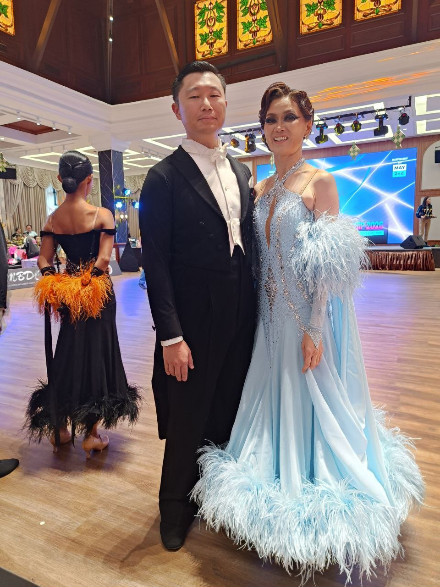
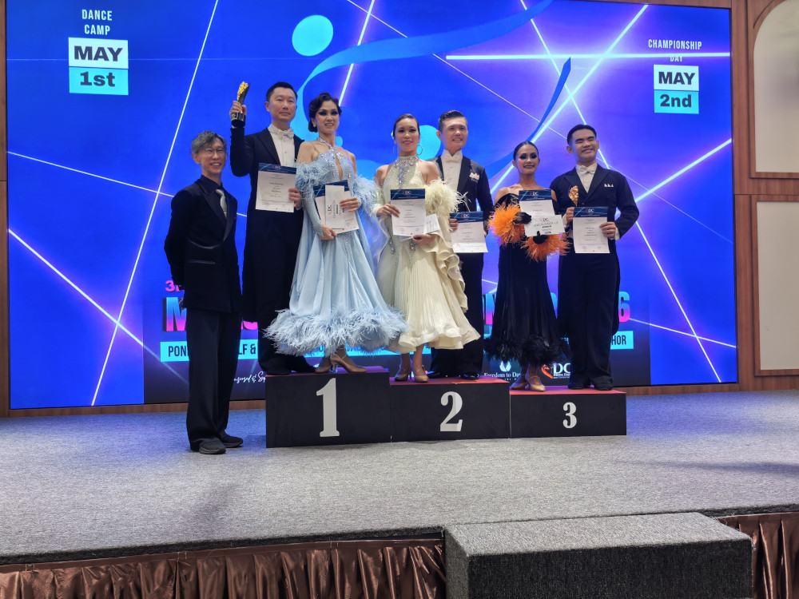
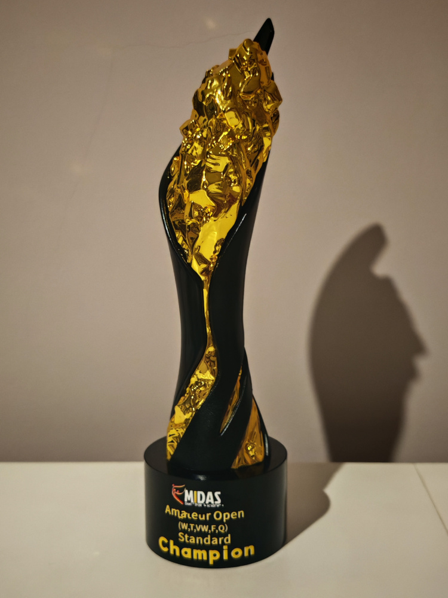

I recently competed in the **3rd Midas Dance Championship**, held on May 2nd, 2026, at the Ponderosa Golf & Country Resort in Johor Bahru. This marked a significant milestone for me: my debut in the Amateur Open category.

<!--more-->

## The Results

*   **Amateur Open (WTVFQ):** 1st Place 🥇
*   **Amateur Rising Star (WTFQ):** 2nd Place 🥈
*   **Adult Over 35 (WTF):** 1st Place 🥇

## A Weekend of Firsts
This competition was a series of "first-time" moments: my first Amateur Open, my first time performing an intro dance, and—most importantly—my first time clinching a win in an Amateur event.

## Breaking the Bottleneck
It’s easy to doubt your progress when you feel stuck in a plateau. I’ve spent the last year wondering if I was truly improving or just spinning my wheels. These results provided the much-needed validation and the motivation to keep pushing forward.

## The "No Turning Back" Strategy
My philosophy for growth is simple: sign up for the challenge first, then figure out how to survive it. Once you’re committed and there’s no turning back, "training hard" becomes the only option. I pushed myself to the limit during prep, and seeing it pay off means zero regrets.

## What’s Next?
The target has shifted. My next goal is to compete at the **national level**. 

加油 💪!