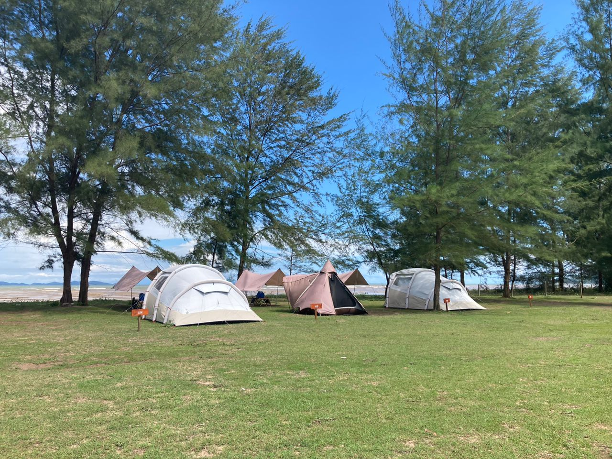
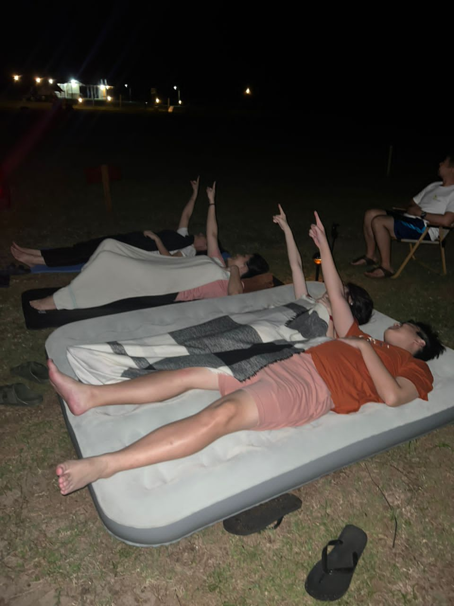
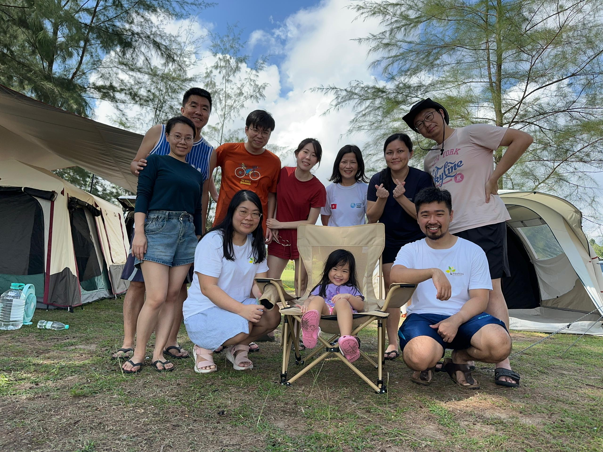

This is my 5th camping trip, Back To Nature [again](). It is my first group camping, previously it was just me and my wife. This time with colleagues.

<!--more-->

# Camping With Colleagues

Initially I was sharing my camping experience with MC and that got him interested. So he organized a group camping trip. He invited Melvin family, Wern Jien family, Shieh Lin and her boyfriend, me and my wife. Suchin also join us after hearing my camping stories. Camping can be really contagious 😷.

All of my colleagues are first's timer. MC did a lot of research, bought equipments and try them out for the first time. He is very well equipped for a first timer. Butterfly tarp, spiral hook (猪尾巴挂钩), hanging flashlight and lamps, collapsible storage boxes, ... Setting up the 5m tarp took him quite a long time due to the strong wind. Eventually he setup a very nice, taut tarp alone.

Suchin borrowed [Naturehike P2 Tent](https://bit.ly/41sw4kv) from a friend, brought yoga mat as sleeping pad, and a foldable stool. She enjoys such minimal approach. I like that tent and is considering to get one for solo camping. It is very lightweight, easy to setup, and comes with 2 doors. Well ventilated, with sheltered area to place shoes outside the tent.

The other 3 colleagues rent tents and equipments from BTN. Hassle-free camping.

# Geminid Meteor Shower

The highlight of this camping trip is watching [Gminid Meteor Shower](https://www.space.com/34921-geminid-meteor-shower-guide.html). It started in November and peaked on 14th December. It is monsoon season and has been raining daily. We were afraid that we might not get to see the meteor shower. There were sporadic shooting stars at around 11 PM. As it gradually get more intense, it started to rain. Fortunately everyone gets to see some meteor shower before the rain starts.

This is a group photo with Wern Jien's cute daughter in the center. Unfortunately Melvin left early in the morning.