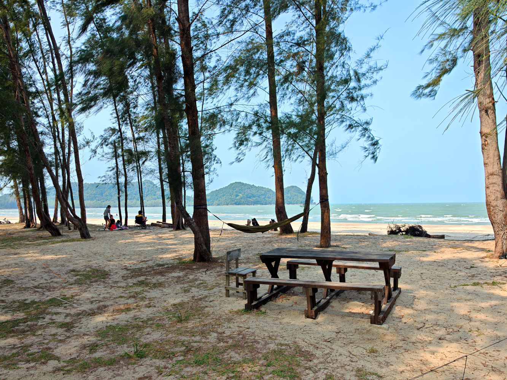
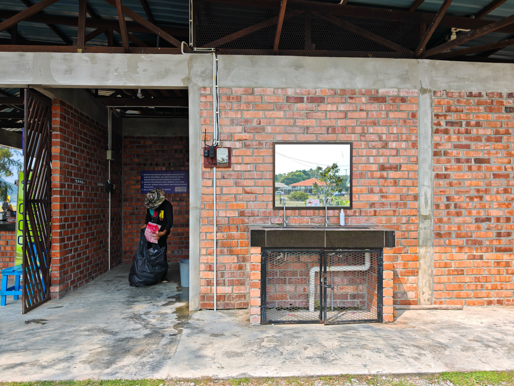
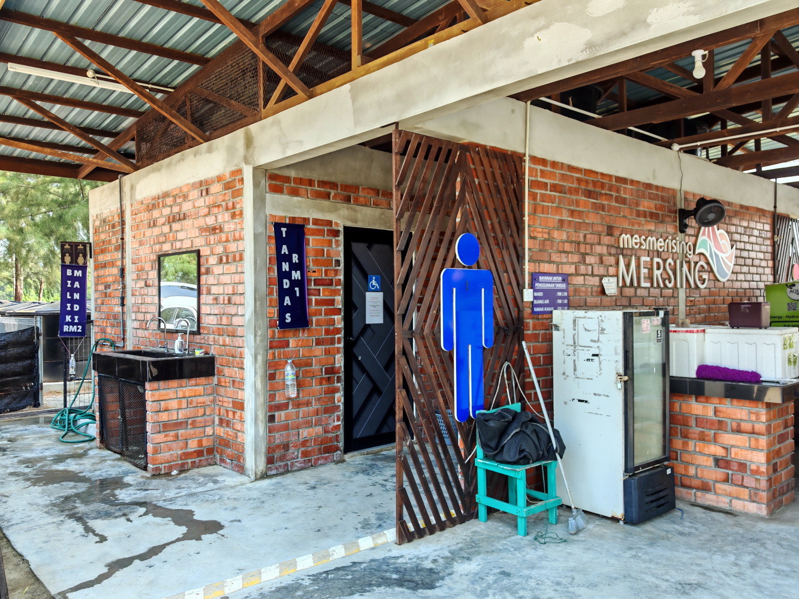
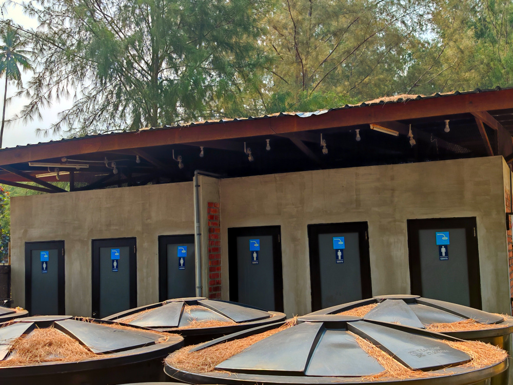
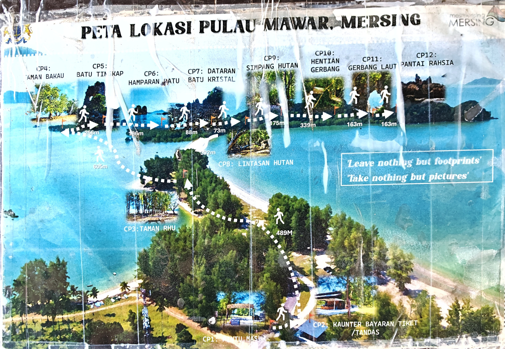

I went camping at Mersing Geopark on 5th September 2026. It's a fantastic spot for stargazing and exploring the iconic [Heaven's Gate](https://thesmartlocal.com/read/pulau-mawar-mersing-jb/).

<!--more-->

# The Campsite

Pulau Mawar is a public campsite with plenty of mature trees and scattered wooden picnic tables. There are no designated lots, so you can set up your tent anywhere along the beach on a first-come, first-served basis. Best of all, car camping is allowed—you can park right next to your set-up.

The abundance of trees provides ample shade from the tropical heat and plenty of natural anchor points to hang a hammock.

# Facilities & Toilets

The campsite facilities are impressively well-maintained. The male and female restrooms are separated, as are the toilet and shower stalls. Rather than basic village-style (*kampung*) facilities, the washrooms are fully tiled, clean, and modern.

# Getting There & Registration

Set your GPS to "[Pantai Mawar](https://maps.app.goo.gl/W3YHXq95aBhyuXS18)" on Google Maps. The drive takes approximately 2 hours and 21 minutes from Johor Bahru. Once you pass through the main barrier gate leading to the beach, you'll find the registration counter immediately on your right.

# Fees

- **Children (under 12):** Free
- **Overnight Camping:** RM 25 / adult per night *(includes toilet & shower access)*
- **Day Trip / Picnic:** RM 5 / adult *(toilet usage charged separately)*

# Essential Tips Before You Go

- **Check Wind Warnings:** Monitor the [Malaysian Meteorological Department](https://www.met.gov.my/en/) before setting off. Strong coastal gusts can make camping unsafe.
- **Tarp Setup:** High winds can make pitching a flysheet or tarp tricky. Secure one end firmly to a sturdy tree before raising the poles.
- **Gear Up:** Standard tent pegs won't hold in soft beach terrain—bring dedicated sand pegs/anchors.
- **Tide Planning:** If you plan to trek to Heaven's Gate, check the local [tide forecast](https://www.tide-forecast.com/locations/Mersing/tides/latest) in advance. The sandbar pathway is only accessible during low tide.

