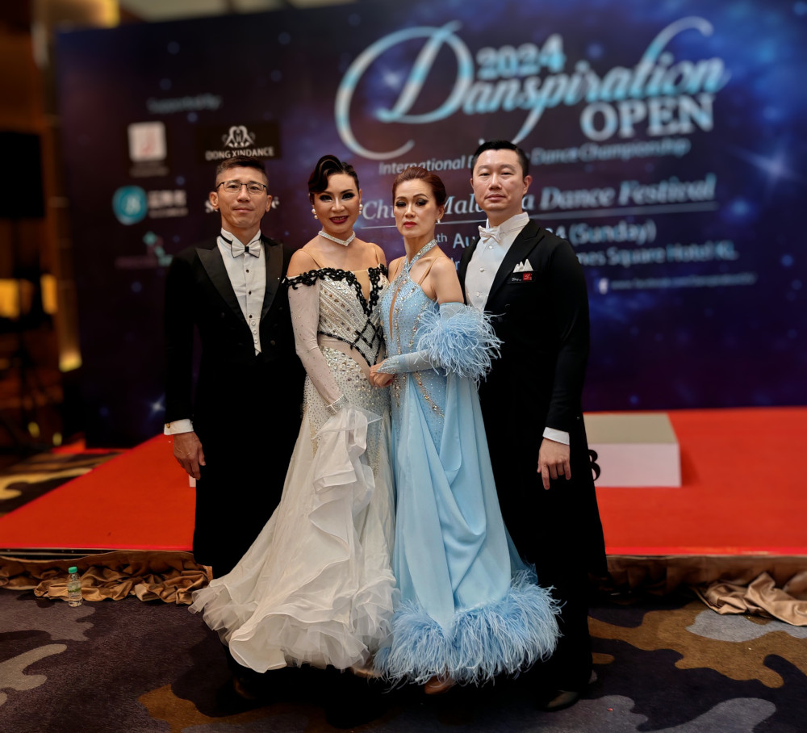
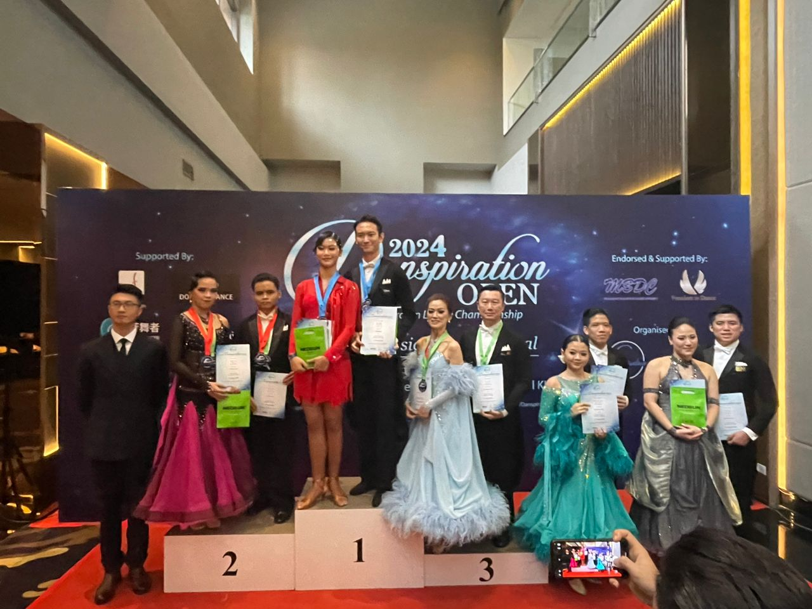
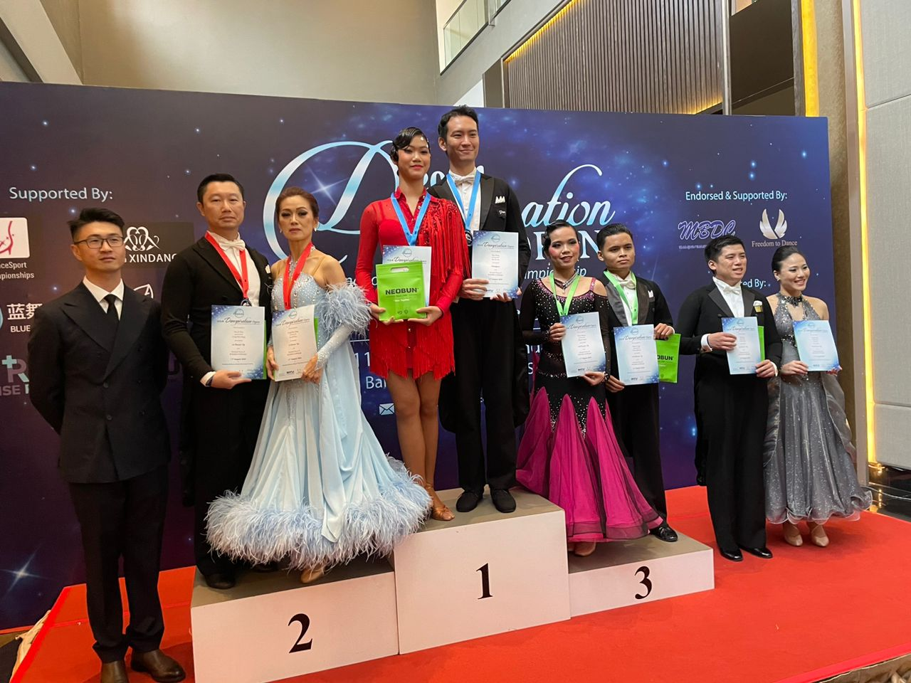
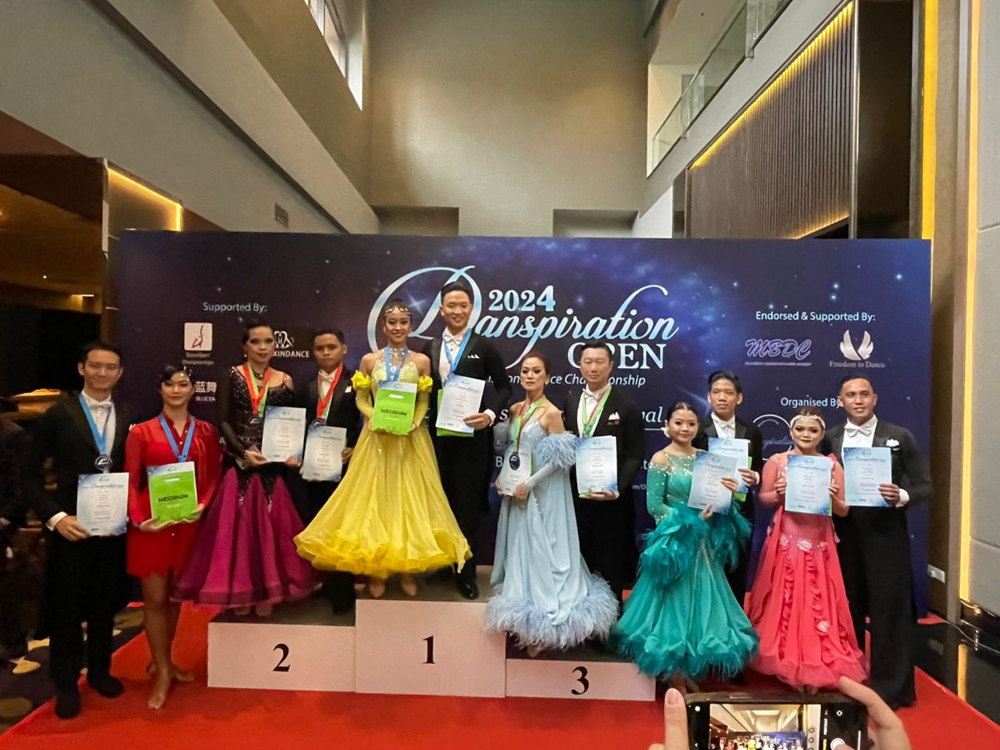
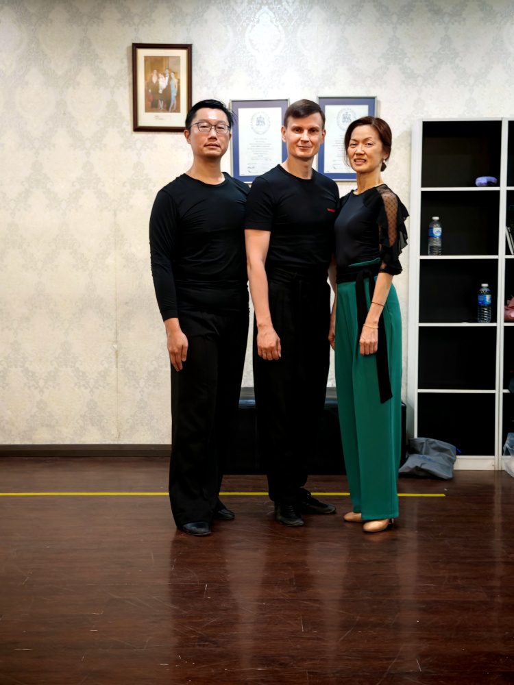
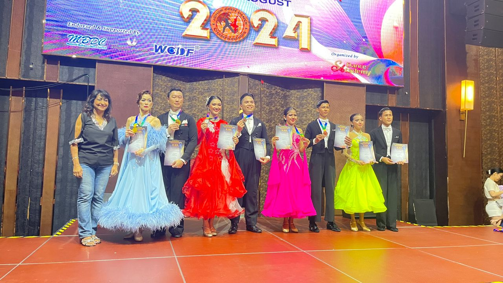
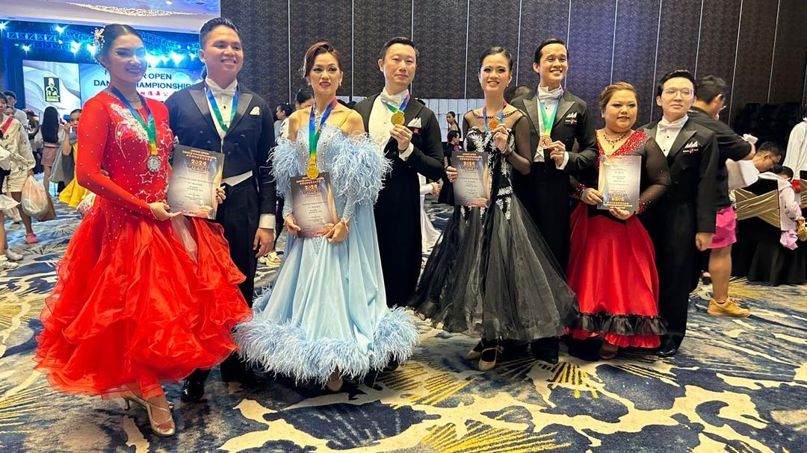
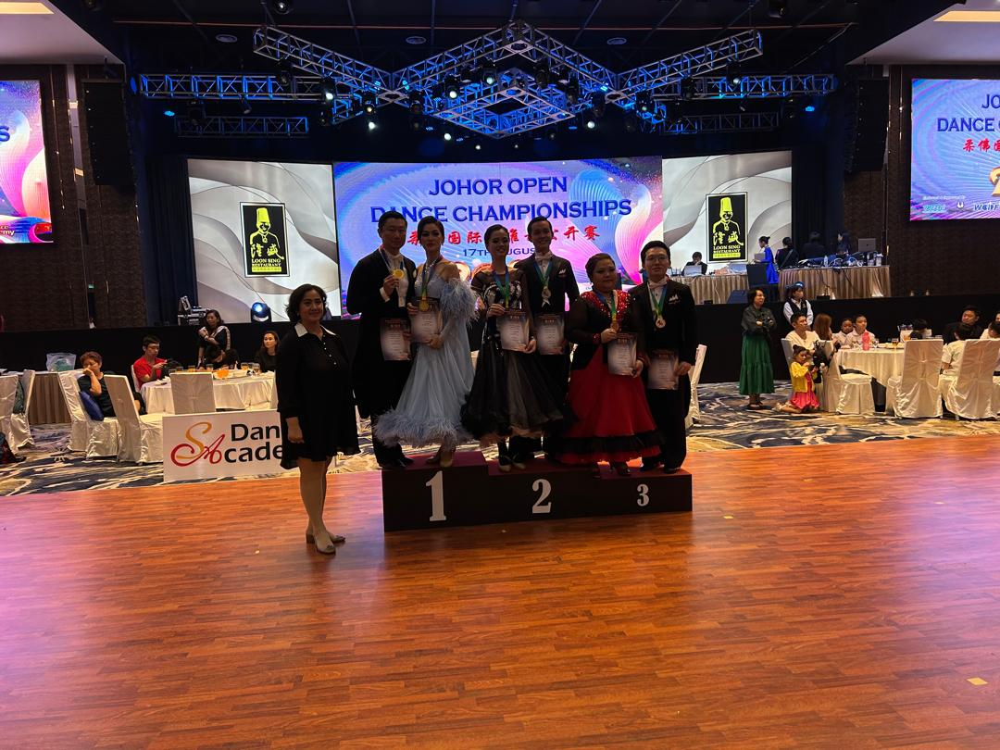
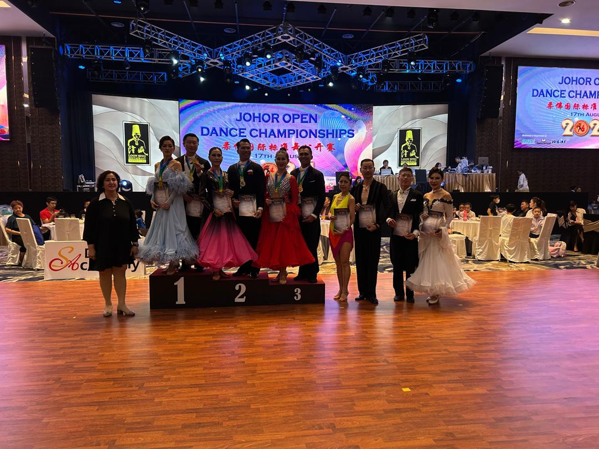
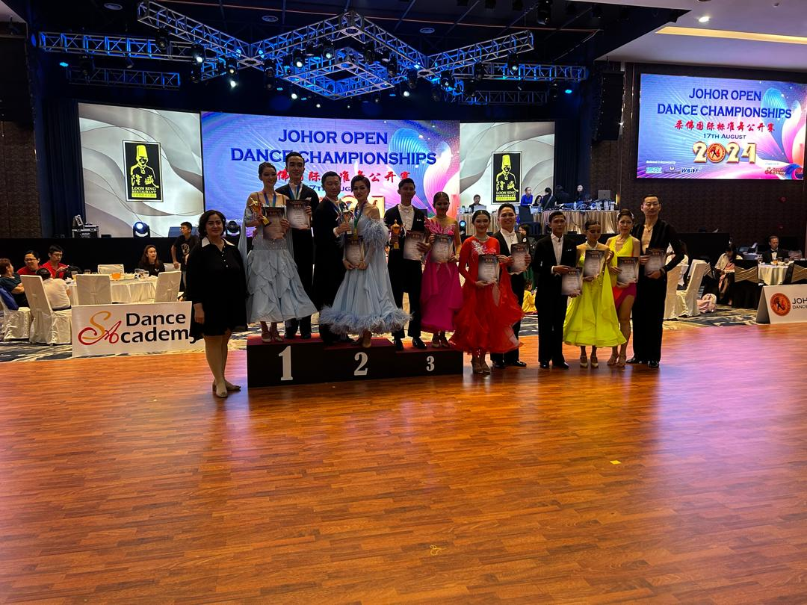

Attended Danspiration and Johor Open dance competition in August 2024. Such arrangement of competitions in consecutive weeks pushes me to train hard consistently.

<!--more-->

# Danspiration Open 2024

Danspiration Open was held on 11 August 2024, at Berjaya Times Square Hotel. Before this competition, we had lesson with teacher Nardrudee Bothaworn from Thailand.

Achieved 3rd placing in Novice A (W, Q).

Achieved 2nd placing in Novice B (T, F).

Achieved 3rd placing in Pre-Amateur (W, T, Q).

# Johor Open 2024

Johor Open was held on 17 August 2024, at Loon Sing Restaurant (Taman Daya). Before this competition, we had lesson with teacher Roman Panin from Russia.

Achieved 1st placing in Novice A (W, Q).

Achieved 1st placing in Novice B (W, T).

Achieved 1st placing in Novice C (W, F).

Achieved 1st placing in Combined Age 80 & Above (W, T, F).

Achieved 2nd placing in Pre-Amateur (W, T, Q).

# Thoughts

* Last year I felt stagnant and discouraged. This year I see significant improvements.
* Got to take bigger (second) step.
* Need to work on keeping body straight, no twisting.
* Need to maintain the frame, keep body facing partner.
* Ensure shoulders are straight.