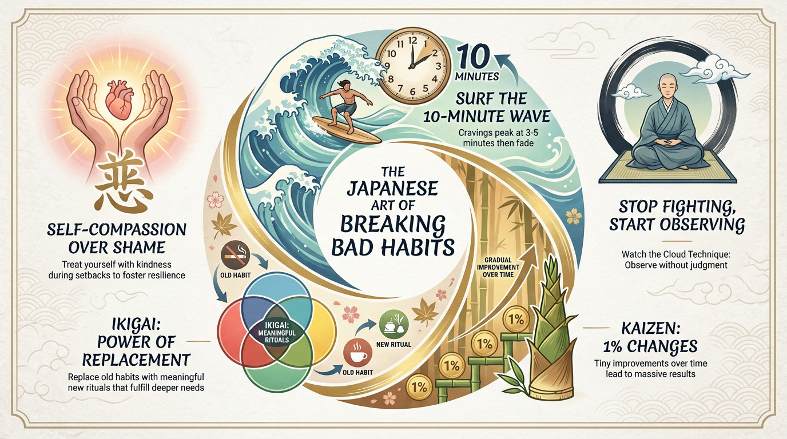

[*This article is adapted from ["The Japanese System for Breaking Bad Habits & Addiction | Kaizen & Ikigai Philosophy
"](https://youtu.be/IHz85fCsJ4g?si=oWjaTiw1EpjutLbK)*]

We have all been there. You join a gym in January with an intense plan, only to quit by February. You delete social media apps in a digital detox, only to reinstall them days later. You make grand promises to change, but when you fall short, you feel shame.

In the West, we are taught to treat bad habits as enemies to be defeated through force and willpower. But what if fighting your habits is exactly what gives them power?.

There is a different way. Drawing from Japanese philosophy, we can look at a system that works *with* the mind rather than against it. It turns out that everything we think we know about breaking habits might be backwards.

## 1. Stop Fighting, Start Observing
The Japanese approach begins with a fundamental shift: instead of viewing habits as enemies, view them as patterns that once served a purpose. Even destructive habits began as solutions to problems—a way to find comfort during stress or loneliness.

When we try to suppress an urge, it often grows stronger. Consider the story of a monk who struggled with anger. He tried meditation, fasting, and repression, but the anger only grew. An older monk taught him a new method: **Become curious about it.**

* **The "Watch the Cloud" Technique:** When an urge arises, watch it like a cloud passing through the sky.
* **Don't Judge:** Do not fight the feeling. Simply observe it.
* **Note It:** Quietly note to yourself what is happening (e.g., "Anger is here").
* **Feel It:** Notice where it lives in your body—the heat in the chest, the tension in the jaw.

By observing without judgment, you create space between yourself and the habit. You are not the craving; you are the awareness observing it.

## 2. Surf the 10-Minute Wave
A core principle of this philosophy is impermanence—understanding that nothing lasts forever, including cravings.

Most cravings feel permanent in the moment, but they are actually quite brief, usually peaking between 3 and 5 minutes. If you can "surf that wave," the urge will fade.

**Try the 10-Minute Rule:**
A Tokyo businessman used this to quit a 20-year smoking habit. He didn't throw his cigarettes away. Instead, when a craving hit:
1.  He picked up the cigarette and fully experienced the craving.
2.  He set a timer for 10 minutes.
3.  He told himself he could smoke when the timer rang.
4.  He sat with the discomfort without distracting himself.

By the time the 10 minutes passed, the intensity of the urge had faded, and he could choose not to smoke.

## 3. Kaizen: The Magic of 1% Changes
Western culture loves dramatic transformations—we want to go from "couch potato to marathon runner" overnight. But this triggers the brain's alarm system, causing resistance and anxiety.

The Japanese concept of **Kaizen** means "continuous small improvement" . instead of changing everything at once, you change 1% at a time.

**How to apply Kaizen:**
* **TV Addiction:** If you watch 4 hours of TV, don't go cold turkey. Reduce it by just 5 minutes.
* **Shopping Addiction:** One woman cured her shopping habit not by cutting up credit cards, but by waiting 24 hours before buying an item. Over six months, she gradually extended this wait time to a week.

These changes are so small they slip under the brain's radar, bypassing resistance and allowing neural pathways to rewire gradually.

## 4. Ikigai: The Power of Replacement
Habits often stick around because they fill a void. We smoke because we are stressed; we scroll because we are bored. If you remove the habit without addressing the need, the void remains.

The concept of **Ikigai** relates to your "reason for being". You must replace the destructive habit with something that aligns with your values and meets the underlying need.

**Case Study:**
A programmer realized he wasn't addicted to alcohol, but to the *transition* it provided between work and personal time.
* **The Replacement:** He developed a new ritual. He changed clothes, made tea, and spent 10 minutes sketching—a childhood passion.
* **The Result:** This met his need to "shift gears" in a way that aligned with his creativity, causing the pull of alcohol to weaken naturally.

## 5. Replace Shame with Self-Compassion
Perhaps the most important lesson is regarding shame. In the West, we use shame as a whip to drive ourselves forward, but this creates a cycle of rebellion and self-sabotage. You cannot hate yourself into becoming someone you love.

When you slip up, treat yourself like a good friend: with kindness and understanding.

**The "Gentle Inquiry" Method:**
An emotional eater learned that punishing herself only led to more eating . instead, she started noting facts without judgment: "I ate more than my body needed". She then asked curious questions: *What was I feeling before I ate? What need was I trying to meet?*. This awareness allowed her to address the real issues, like loneliness or anxiety.

## Summary: Building New Paths
Think of your habits like paths in a forest. The old habits are well-worn and easy to walk. You cannot simply erase that path, but you can build a new one.

At first, the new path is difficult and requires effort. But with repetition, the grass gets trampled down, and the new path becomes the easy choice.

Lasting change isn't about conquering yourself or fighting a war. It is about growing into a fuller version of who you already are.

**What is one tiny, 1% change (Kaizen) you can make today to start building your new path?**