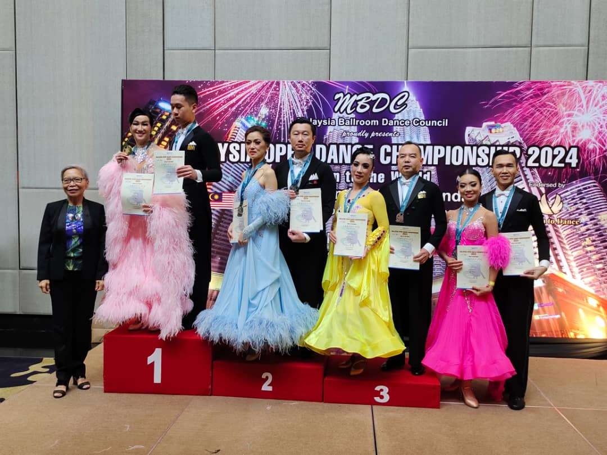

Malaysia Open Dance Championship 2024 was held on 17th November, at Berjaya Times Square Hotel in Kuala Lumpur. I competed in Novice A, Novice B, Combined Age Above 80, and Pre-Amateur.

<!--more-->

1st place in Standard Pre-Amateur WTQ.

3rd place in Novice A WQ.

2nd place in Novice B TF.

4th place in Combined Age Above 80 WTQ.

Novice and combined age events were scheduled in the afternoon at 1:30 PM. Pre-Amateur event was scheduled at 10:30 PM, toward the end of the whole competition. That is a long waiting time.

I performed very badly in the afternoon, especially Waltz. This is quite puzzling as my Waltz is usually the best among 4 dances (WQTF). I think I haven't warm up enough, the body was not ready yet.

After the afternoon events, Ai Choo and I analyzed our mistakes and also asked teacher for feedback. Adjustments was made for the Pre-Amateur event. We performed better, but getting 1st place was totally unexpected! We have just started competing in Pre-Amateur level this year, I did not expect to get into the top so soon.

I think we are now still at Novice level. Amateur level is still a long way to go.

There were quite a number of senior couples from Hong Kong. They dance really well 🙂. This is a grand competition, having dancers from China, Philippines, Singapore, Russia, USA, Korea, Japan, ... My favorite part of the competition is to watch the professionals compete.