I spent a day at IOTE Expo 2026, the 25th International Internet of Things Exhibition, at the Shenzhen World Exhibition and Convention Center. More than a thousand exhibitors across four halls. I walked in expecting sensors, RFID tags, and industrial connectivity. I left thinking about agent workspaces and AI plush toys.

<!--more-->

Three layers of the AI stack showed up in that one day. The software layer, where every big vendor is now selling an agent workspace. The physical layer, where AI is climbing into toys, robots, and headbands. And the layer underneath both, which is compute and licensing. Here is what I actually saw, and what I am taking away from it.

## Everyone is building the same agent workspace

The most consistent thing in the expo was not any single product. It was the shape of the products. Tencent, AWS, and a Shenzhen startup called [Nextflow](https://www.nextflowai.io/zh) are all selling variations of the same bundle: a chat interface, agents that plan and use tools, deep research, workflow automation, and business intelligence.

[Amazon Quick](https://aws.amazon.com/quick/) is the reference implementation. It launched in late 2025 as the successor to Amazon Q Business and QuickSight, and AWS has been quietly turning it into an entire office suite for agents: chat, shared spaces for teams, research reports with citations, workflow automation, BI dashboards, even no-code apps. It connects to Jira, Salesforce, Slack, Notion, Snowflake, and thousands of other applications. The named customers are 3M, BMW, DXC, Jabil, and New York Life.

The pricing tells you where this is heading. Quick charges USD 20 per user per month for the Plus tier, then USD 20 per user plus USD 250 per account per month for Professional, and agentic work is metered in hours: USD 3 an hour for agentic tasks, USD 6 an hour for research. Tencent's [CodeBuddy](https://www.codebuddy.ai/) uses a similar credit system, with a Team tier at USD 40 a seat. Microsoft and Google are doing the same thing behind closed doors. The industry is converging on per-seat pricing plus metered agent compute. If you are budgeting for AI tooling next year, model for usage, not just seats.

The other notable pattern was MCP. AWS documents MCP server support in Quick. Tencent documents it in CodeBuddy. The open standard for connecting agents to tools is quietly becoming the connective tissue of the whole category. Every vendor seems to be betting that agents will plug into an open tool ecosystem instead of a proprietary one. That matters when you are choosing a platform, because it means your tools are not locked in.

Nextflow's poster said it better than anyone: "让 AI 从回答问题升级为完成任务". Upgrade AI from answering questions to completing tasks. Every agent workspace at the expo is chasing the same loop: understand the goal, plan, call tools, execute, deliver. That loop is becoming the unit of product design.

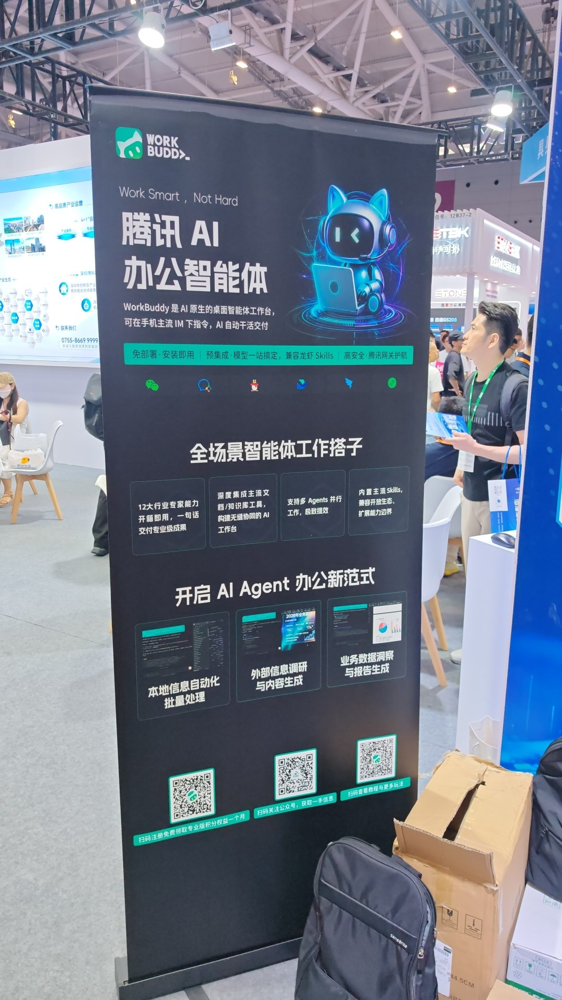

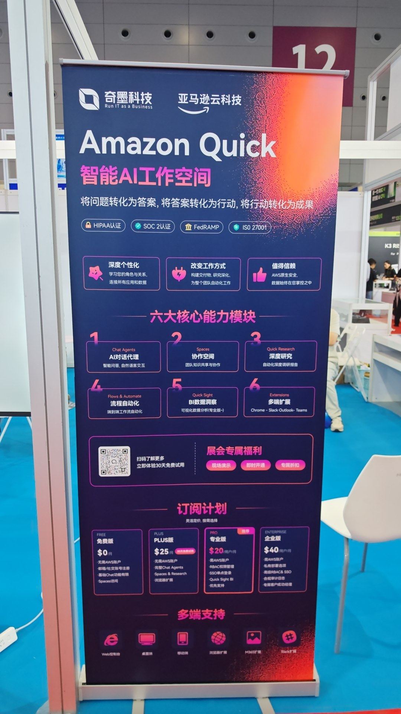

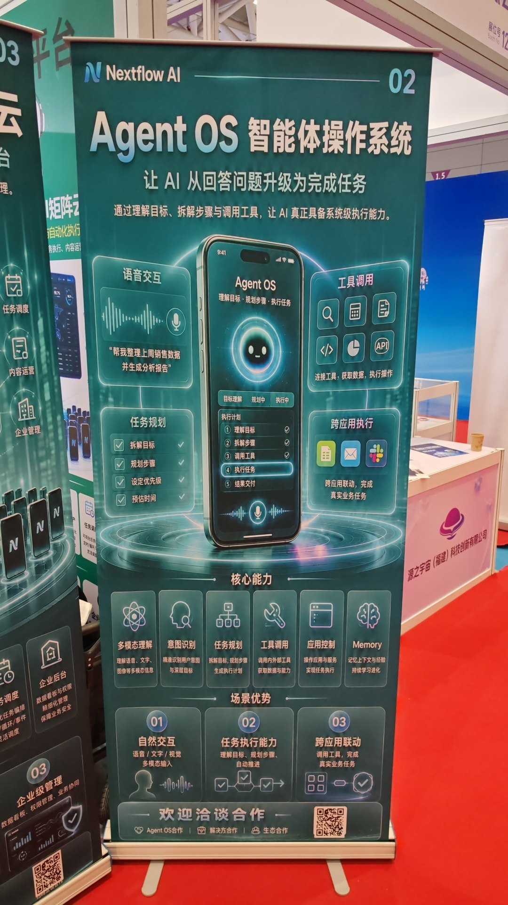

## AI leaves the screen

The second layer surprised me more. AI is climbing into physical products, and Shenzhen is the place where that gets manufactured.

A coffee robot booth caught my eye first, because I have opinions about coffee. [影智×bot](https://xbot.inspace.cc/) sells the machine as RaaS, robotics as a service: the robot, a management dashboard, and a mobile app, so a shop owner runs a whole fleet from a phone. Hardware as a subscription, with AI as the operator.

The companion robot wave was everywhere. [WYNME](https://wyndme.cn/)'s 01 PRO is a home robot for families and kids: multi-turn dialogue, custom voices, voiceprint recognition, long-term memory. It wants to be a child's first AI friend. A few booths away, [BrainLink](https://www.macrotellect.com/web/pro/default.html) makes an EEG headband that reads brain signals and pairs them with an AI for emotion recognition, then sells the whole thing as a team building experience for companies. Same silicon underneath, two completely different customers.

My favorite product of the day was the least flashy one. [moben](https://moben.cn/) is a voice assistant the size of a small book, with an e-ink screen and one button. You hold the button, speak, and the AI answers on the ink display. The tagline is "把『不敢问』，变成『放心问』". Turn the questions you do not dare ask into questions you feel safe asking. It is a deliberately anti-phone design: no apps, no notifications, no doomscroll, just a quiet box that answers questions. As someone trying to spend less time on my phone, I found it genuinely appealing.

Underneath all of these sits a supply chain. PAISON sells AI modules for IP and trendy toy brands: WiFi and 4G modules, NFC and touch sensors, connected to the Baidu, Volcano, or Alibaba model ecosystems. They take an IP license and turn it into a shipped plush toy with an LLM inside. [Snow Engine](https://snowengine.cn/) packages the other missing piece: commercial licenses for voice AI, 144 languages, 700 voices, so a hardware maker can ship globally without a legal headache. AI in physical products has stopped being an R&D problem. It is now a supply chain problem, and Shenzhen has the supply chain.

There were also booths I will not dwell on. One was selling an AI content factory for Douyin and Xiaohongshu: generate articles, generate videos, generate fake presenters, publish on autopilot. I took the brochure and put it down. The same technology that makes a coffee robot polite makes a content farm cheap, and I did not find that part inspiring.

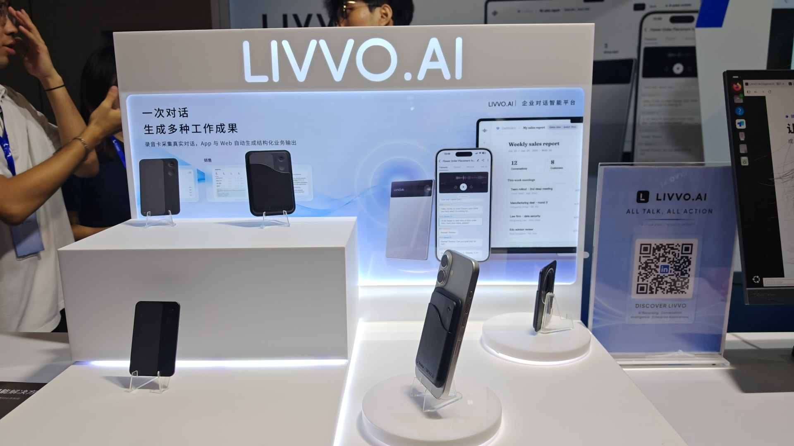

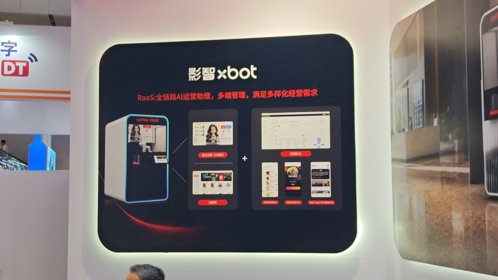

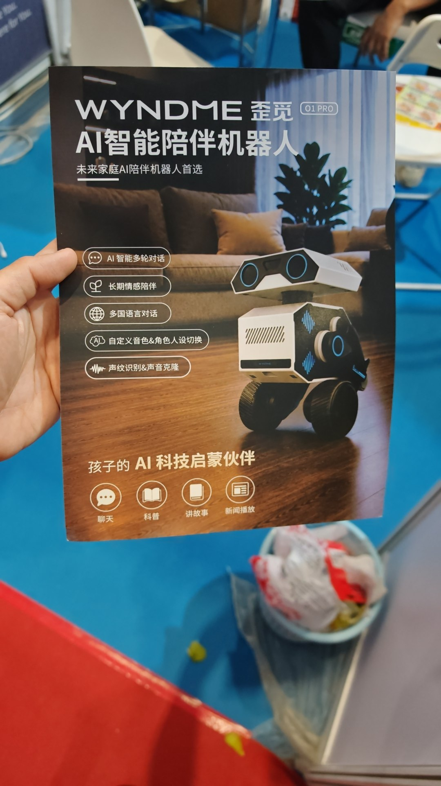

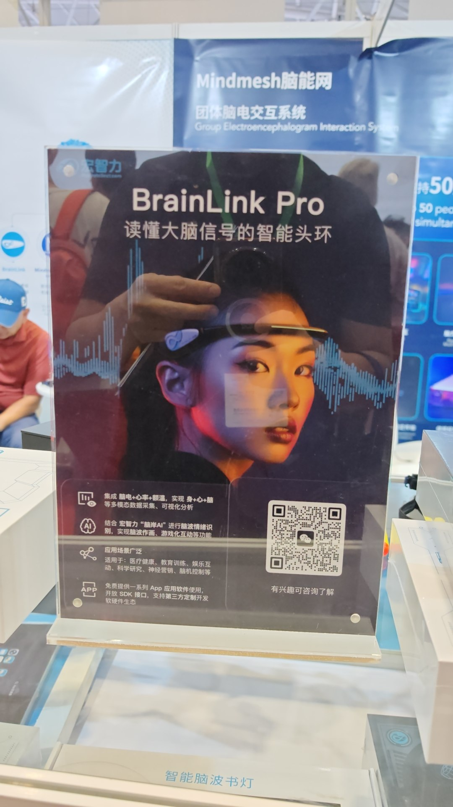

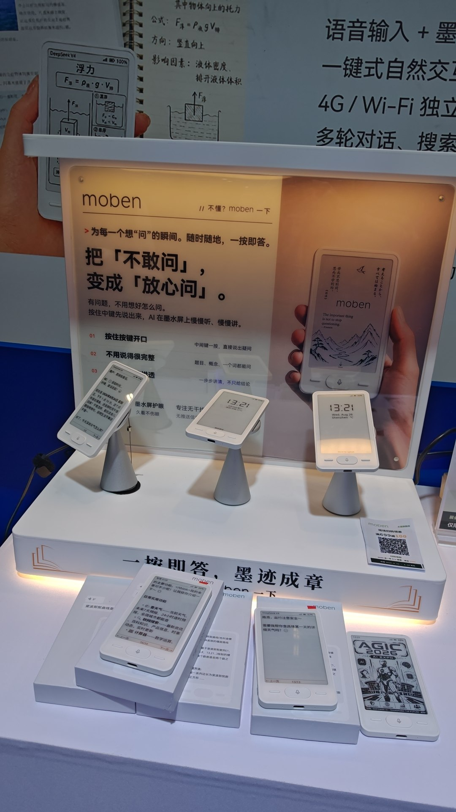

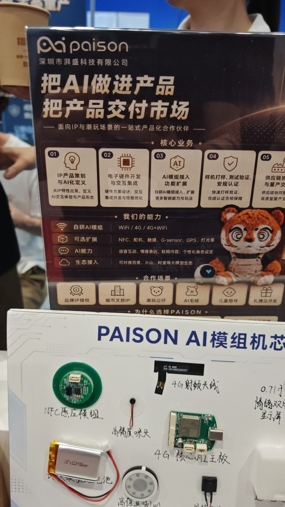

## The compute layer, and a product built on my own platform

Above and below the toys and agents sits the third layer: who provides the compute.

[Paratera](https://www.paratera.com/) is a listed company, nineteen years in high performance computing, now selling an AI computing cloud with the slogan "让大模型算力触手可及". Make large model compute reachable. GPU clouds for inference and training are becoming a productized utility, the way object storage became one.

Then there was [CEPHALON](https://cephalon.cloud/aigc). Their product is called AINPC, a desktop appliance the size of a small cube: AMD Ryzen AI Max+ 395, 128 GB of unified memory, five 3.5-inch drive bays, running an operating system called Lucy AI OS. The selling point is total local control. Data stays on the device, no cloud upload, no token bills. The price is CNY 27,800 with a preloaded LLM, or CNY 24,800 without.

Here is the part I could not stop thinking about. Lucy AI OS lists Hermes as its system-level agent engine. Hermes is the agent platform I run on my own machines. Cephalon took the same stack, put it in a box with storage, and is selling it as an appliance with a skill marketplace on top, where devices clone skills from each other through something called the Cephalon Skill Map.

I did the math a CTO would do. A Ryzen AI Max+ 395 with 128 GB is available barebone for about USD 2,000, from GMKtec or Framework. At CNY 24,800, roughly USD 3,500, the AINPC carries about a 70 percent premium over building the same platform yourself. You are paying for the five drive bays, the industrial power supply, the OS integration, and local support. That is defensible if you want the product. It is not defensible if you just want the compute. I would also point out that the AINPC only has 1 gigabit Ethernet, an odd choice for a five-bay NAS, and that the extra CNY 3,000 for the preloaded LLM is a convenience fee, since the models are open weight and load in an afternoon with Ollama.

Seeing your own platform inside someone else's product is a strange feeling. It was also the most useful signal of the day. The agent loop I use daily, goal to plan to tools to execution to delivery, is not a hobbyist pattern. It is the architecture of a product category. Tencent and AWS are packaging it for enterprises. Cephalon is packaging it for privacy-minded individuals. A coffee robot in Shenzhen is running a version of it to make flat whites.

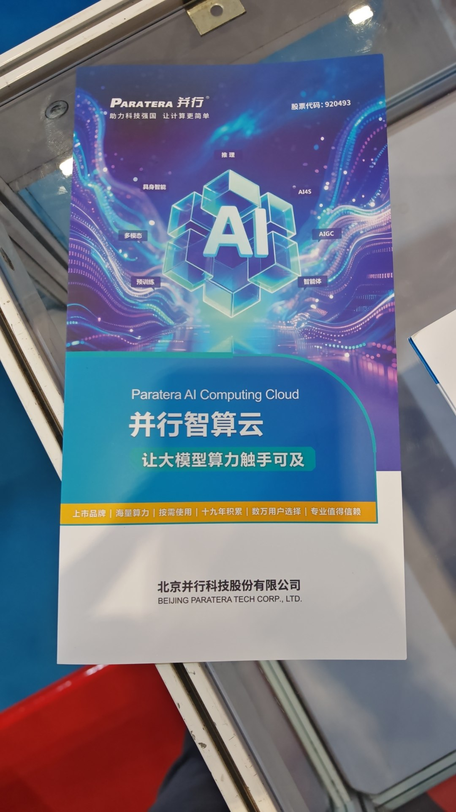

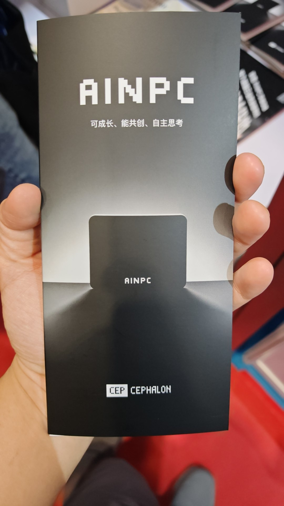

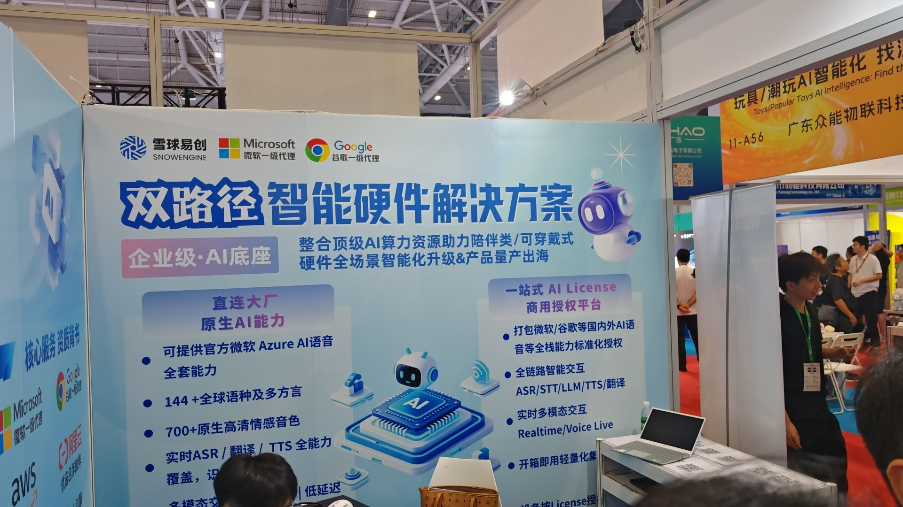

## What I am taking away

1. Agent workspaces are converging on one bundle: chat, agents, research, automation, BI. If you are building internal AI tooling, this bundle is your benchmark.
2. Pricing is moving to per-user plus metered agent compute. Plan budgets around usage, not seats.
3. MCP is becoming the standard connector. Open standards are winning the agent-to-tool layer.
4. AI in physical products is now a supply chain problem. The modules, the licensing, and the manufacturing all exist in Shenzhen today.
5. Local and private AI is a real position. "No cloud upload" sells, and the token bill is the reason.
6. Hardware economics still matter. The appliance premium, the 1 gigabit Ethernet port, the preload fee. Spec sheets tell the truth faster than marketing.
7. The agent loop is the new unit of product design. The moat is not the loop, it is what surrounds it: memory, data, and skills.

One day at an expo is not a market research report. But it is a good check on where the industry is putting its money. Shenzhen's answer this August was agents on every screen, AI in every toy, and compute underneath all of it. I came home with more questions than answers, which is usually the sign of a good day.

## Appendix: booths I captured

| Company | Category | One-liner |
|---|---|---|
| LIVVO.AI | Conversation AI | Recorded conversations become sales reports and meeting minutes |
| 影智×bot | Coffee robot | RaaS: robot, dashboard, and mobile app |
| WYNME | Companion robot | Home robot for families and kids |
| Paratera | AI compute cloud | Listed company selling GPU cloud, 19 years in HPC |
| BrainLink / Macrotellect | BCI | EEG headband plus emotion AI, sold as team building |
| Tencent WorkBuddy | Agent workspace | Desktop AI office assistant |
| Amazon Quick | Agent workspace | AWS agentic workspace suite |
| Nextflow Agent OS | Agent OS | From answering questions to completing tasks |
| moben | Voice device | One-button e-ink voice assistant, anti-phone |
| Tencent CodeBuddy | AI coding | IDE, CLI, plugin, and NPC cloud agents |
| PAISON | AI module maker | Chip-to-shelf modules for AI toys |
| CEPHALON AINPC | Local AI appliance | Hermes and Ollama in a 5-bay NAS box |
| Snow Engine | Voice licensing | 144 languages, commercial licenses for hardware |
