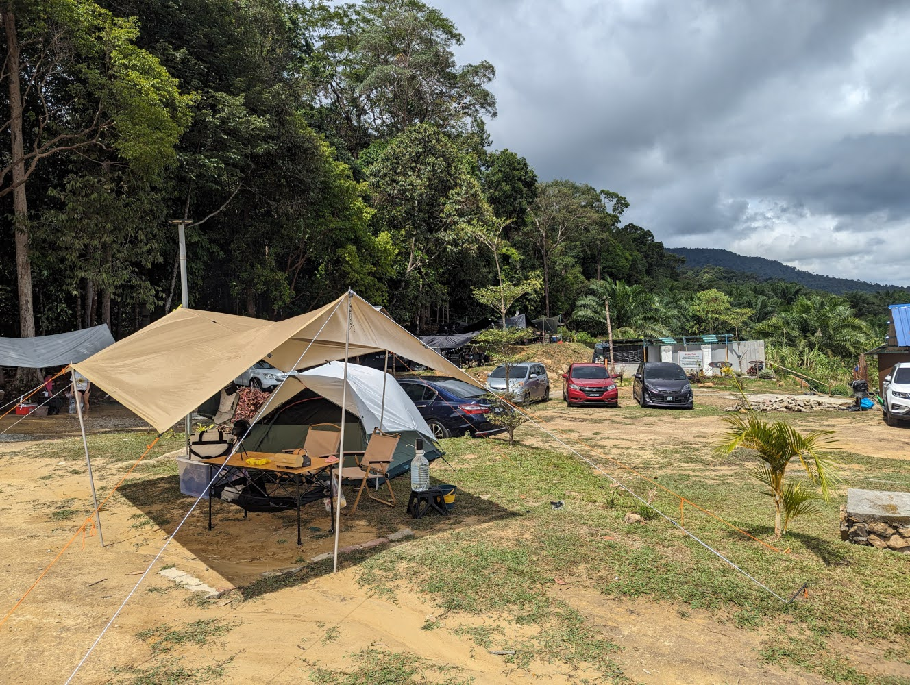
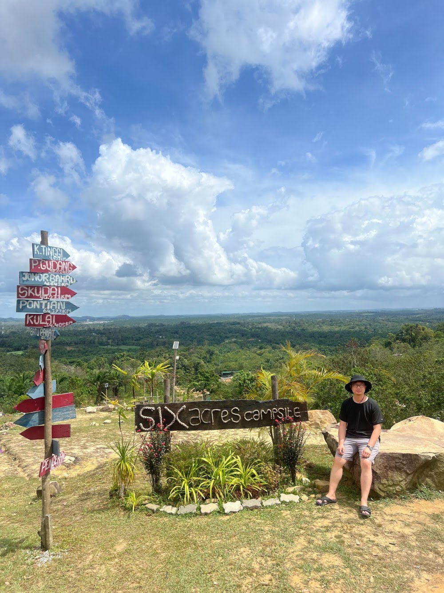
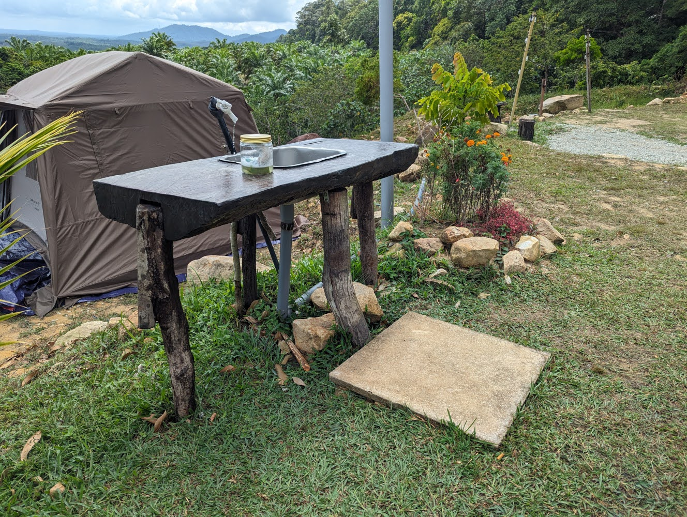
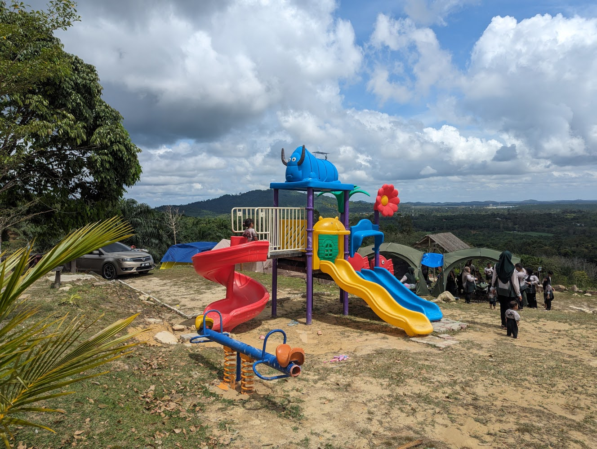
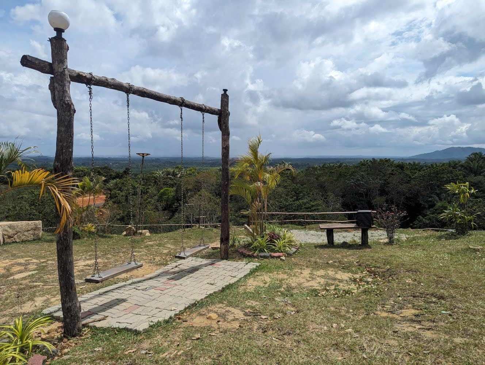
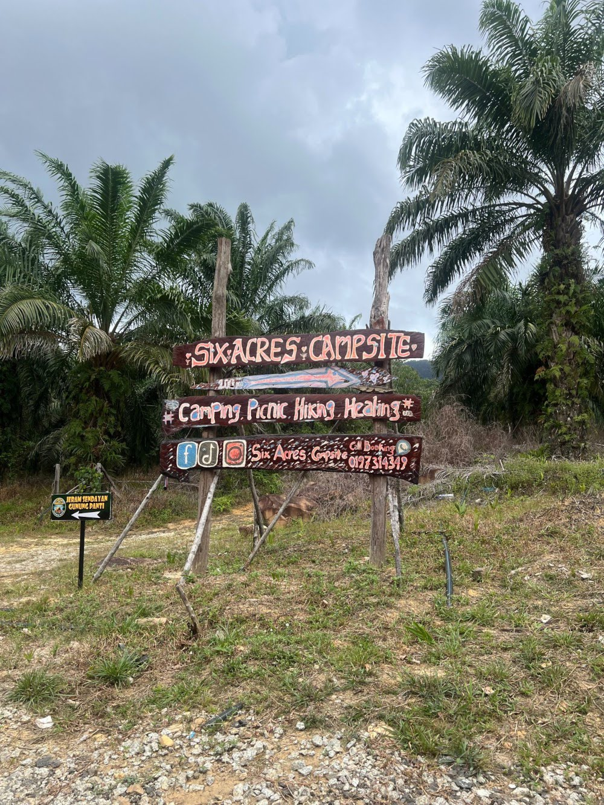
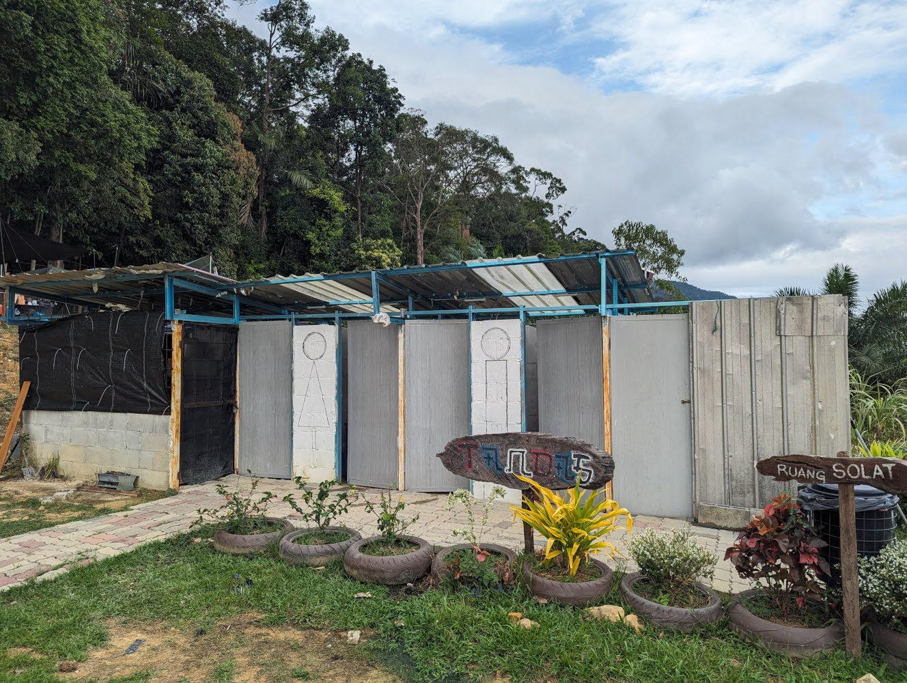

7th camping trip at [Six Acres Campsite](https://www.facebook.com/p/Six-Acres-Campsite-100085035072469/) in Kota Tinggi, Johor. Camping on a hill met with heavy rain.

<!--more-->

# Impression

Similar to [Yaka Campsite](), this campsite sits on a hill. There are designated slots, some on flat land and some on the slope. Some of them are under tall trees, another 2 are sheltered.

It was 2nd March 2024, campsite was fully booked. I was allocated slot #8, which is a flat land without any trees. I was unable to hang by hammock 🙁. The soil is quite firm, so 15cm tent stakes are sufficient. The place where I camped gets really muddy under rain. Tip: *try to secure a slot with grassland and trees*.

The parking lots and campsite are separated. I am lucky to get a slot near my car.

Besides toilet area, there are also basins within the campground. Conveniently accessible and reduces queue for basin. Water comes from nature source, it seems cleaner than [Tiger Base Camp]().

There is a photo spot, overseeing the forest under the hill.

# Best Part

Campsite is clean, well-maintained. No bug/mosquito. For those camping under the trees backing the forest, I am not sure if it is also mosquito-free. Good mobile (Digi) reception. 

# Kids Friendly

Kids might like the playground and swings. There is also a stream nearby.

# Getting There

Search for "[Six Acres Campsite](https://maps.app.goo.gl/VWrFr8HotFXL9Aaq9)" on Google Map and it will bring you to the campsite. You will pass by RAF "Relax And Fun", just continue driving until you see the Six Acres Campsite signboard.

Turn right upon reaching this signboard. When you approached an intersection choose the path on the right, which leads downhill. Driving experience might be a bit intimidating for the inexperienced, four-wheel drive is recommended. 

# Toilets

Male and female toilets are separated. Kampung style toilet with zinc walls.

# General Information

* Contact: [+6019 7314 349](tel:+60197314349)
* Fee per person: RM 30
* Campsite: RM 10 per slot
* Trash fee: *included*
* Check-in time: after 2 PM
* Check-out time: before 12 PM