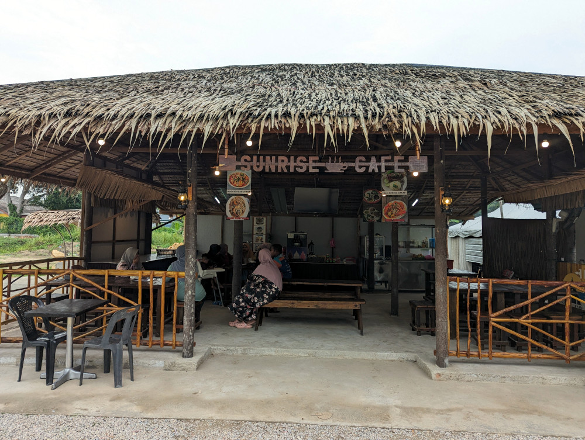
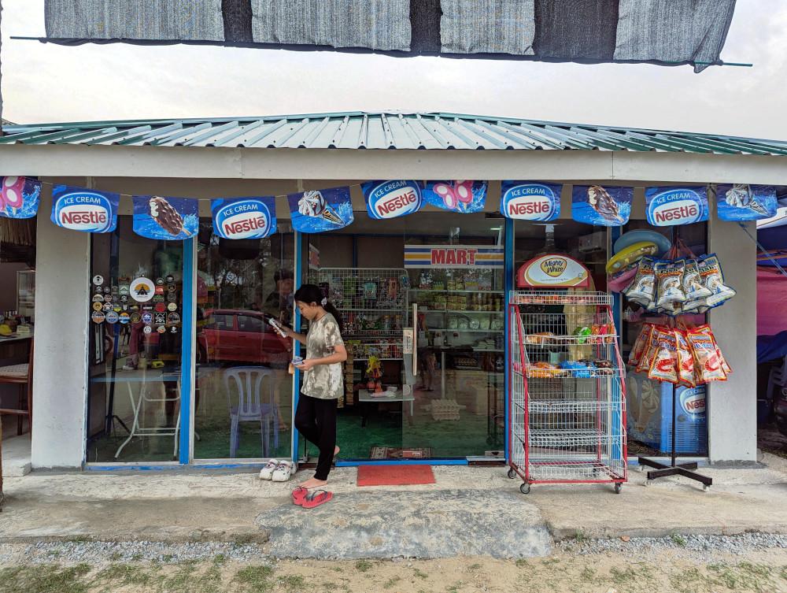
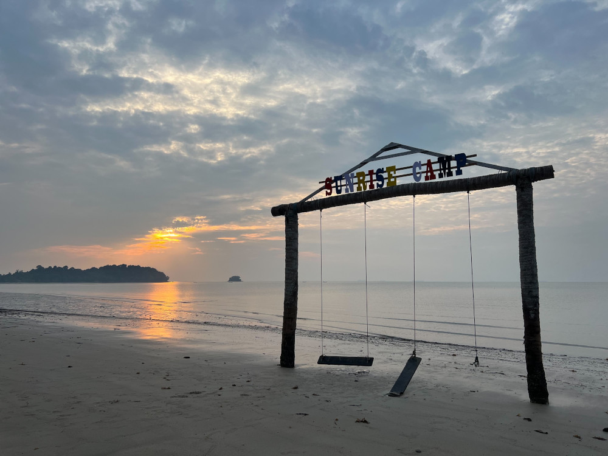
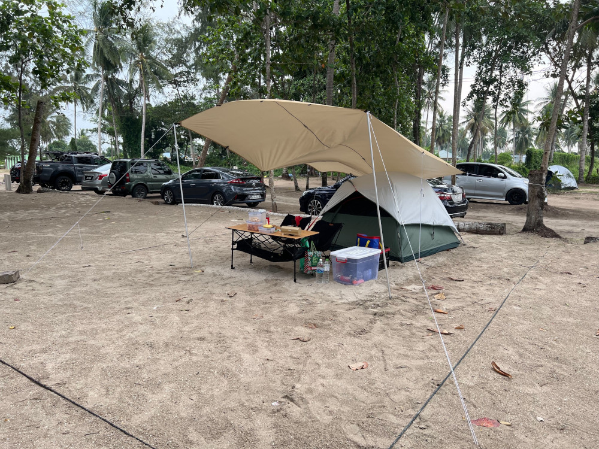
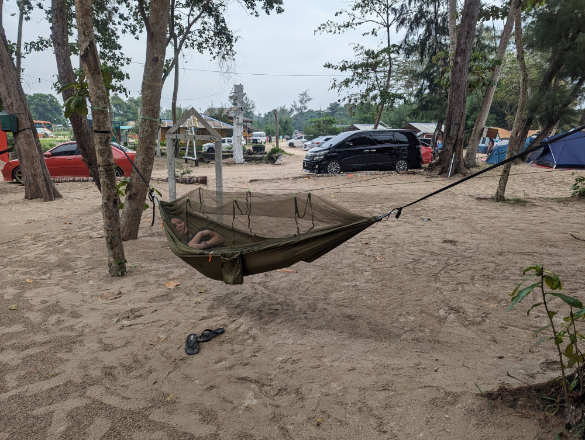
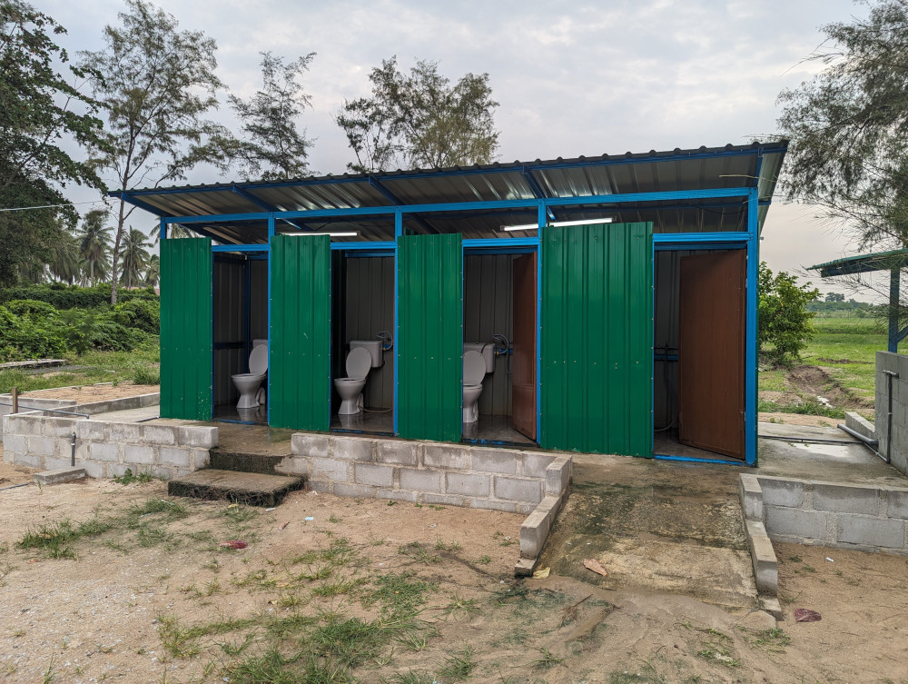
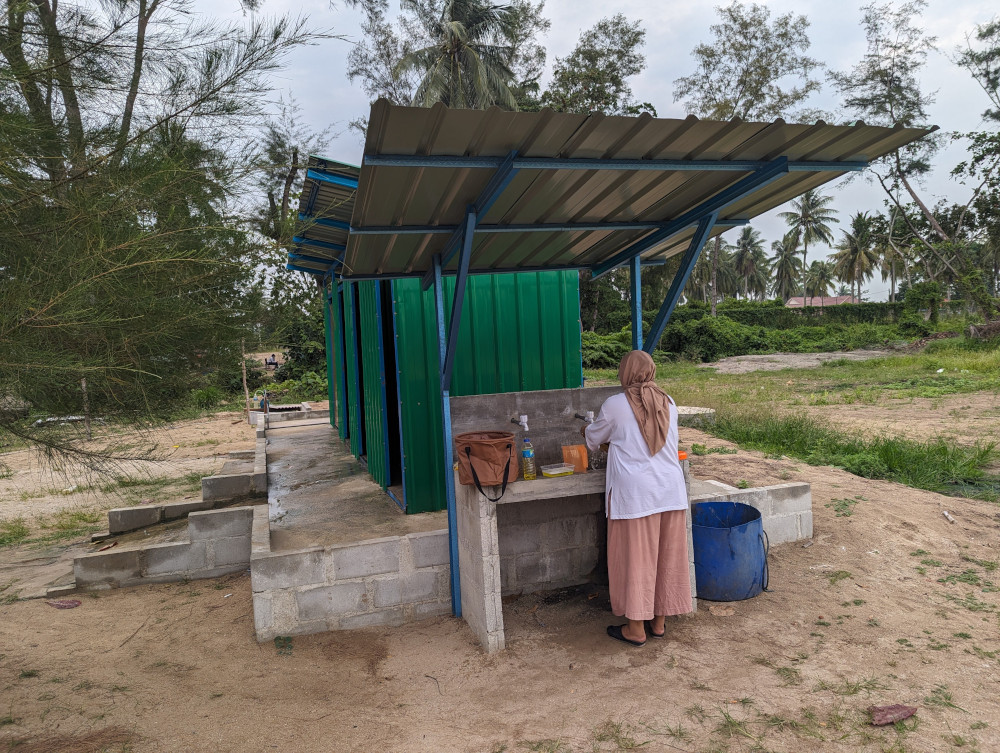

[Sunrise camp](https://web.facebook.com/p/Sunrise-Camp-Kg-Punggai-100083092574296) is a popular campsite among Johoreans. It is located in Bandar Penawar, Desaru, Johor. It seems all 3 campsites (including this trip) that I have visited are all at the beach.

<!--more-->

# Impression

There is a cafe and minimart at the entrance. The cafe serves stir fried food and drink. Minimart sells snacks and some convenient items. This is convenient for campers who did not bring any food for cooking and solves cravings for snack.

The campsite have clearly drawn out slots, you can choose your spot, subjected to availability. I can drive my car right to the allocated slot. I also notice that there are severals huts for rent. Instead of sleeping in tent, you can stay in a hut. It can also serve as an activity area for family/company gathering. One of the huts is designated as a surau for Muslim campers.

What I don't like about this campsite is the litters. There are litters everywhere. There are cleaners, but they are not doing enough to keep the beach clean. Sad to say there are many uncivilized campers/parents. Campers are responsible for their rubbish (not the cleaners). It is a standard practice to bring your own trash bag to collect all your rubbish and dispose the bag at designated collection areas. Parents are also responsible for their children's behavior. On my second day I found chicken bones besides my tent. It likely came from kids littering in previous night. It attracted ants to my tent.

I am not sure if the litters are attracting red ants or they are naturally there. There are a lot of red ants in this campsite. Unlike the common black ants, red ant's bite hurts. The litters and ants makes the camping experience unpleasant.

The beach is quite big. There is another campsite sharing this beach. Sunrise Camp has setup a structure and swings, they are popular spot for photo taking. 

There is also a shared power point, you can access it at RM 10/day. If you are charing your phone, you need to keep an eye on it. I am a Digi subscriber, there is a good mobile coverage. I don't encourage spending time on phone and missing out on the camping experience.

# Booking And Getting There

Contact the operator, [+60 13-705 1559](https://wa.me/60137051559), and make booking via WhatsApp. It is easy to find this place by using [Google Map](https://maps.app.goo.gl/vBX3h8FoC8jAr25AA) or [Waze](https://ul.waze.com/ul?place=ChIJrcy7OOU12jER3c5QF4SE_Ms&ll=1.43593500%2C104.28008870&navigate=yes&utm_campaign=default&utm_source=waze_website&utm_medium=lm_share_location). 

# Campground

The ground is filled with sand. It is important to bring correct tent pegs. When I was setting up my tent and tarp, there were really *strong* wind. It makes setting up really difficult.

I am using a 30 cm steel round pegs. Due to my inexperience, it came loose a number of time due to wind. Eventually I figured out the trick is to drive the peg slightly below ground level. Usually I will leave the top of peg 4 cm above ground. But for sandy ground, you really need to drive it _into_ the ground.

Sand is flying in the wind. I keep my tent doors closed but some fine sand pass through mesh window and get into the tent. These fine sand is harder to clean up than coarse sand. Newbie campers need want to take note of this when camping at the beach.

# Toilet

The are 2 toilet clusters spread in the campsite. They are mainly made out of thin metal sheets. Toilet and showering cubicles are separated. Basin outside the toilet. One of the basins was flooded due to irresponsible camper. Toilet is generally clean, usable.

The water is clean.

# General Information

* Fee per slot: RM 40 / per day
* Access to power point (optional): RM 10 / day
* Trash fee: _none_
* Check-in time: after 1 PM
* Check-out time: before 12:30 PM