Taman Eko Rimba Sungai Pauh campsite is located in Cameron Highland. Cool weather and ASMR water sound makes it an ideal place for camping. I camped there for 3d2n on 11 June 2025.

<!--more-->

# Impression

Weather in Malaysia has been very hot recently. Cameron Highland is a good escape from the heat. It gets quite cold a night, it is recommended to wear sweater, long pant and bring blanket. The water is clean for cooking and cleaning. The campsite is well-maintained. During my stay, I see workers fixing lamp posts and the wooden floor.

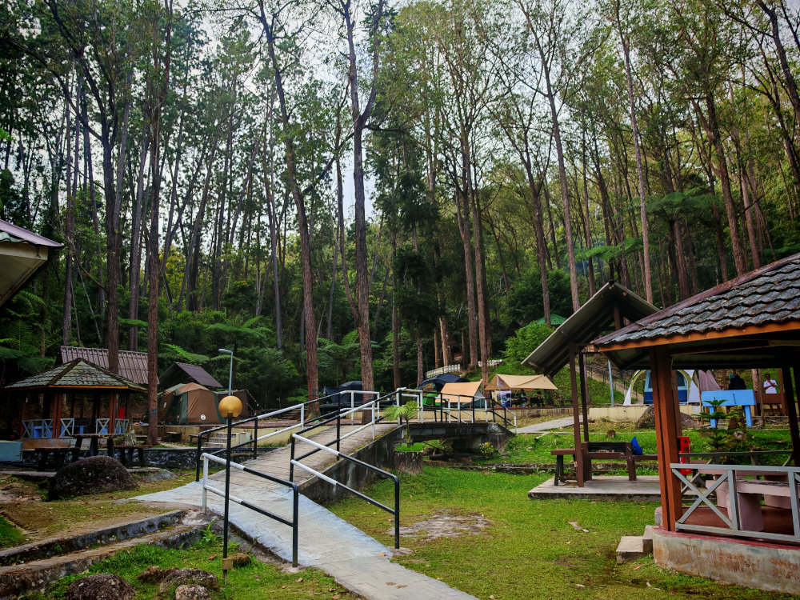

There are lamp posts throughout the campsite, you can walk around at night without needing flashlight.

# Wooden Floor

Campsite operator will assign slots on wooden floor. There will be no issue of sand in tent and muddy floor during raining days. **MAKE SURE** you bring fishbone pegs. The gap between wooden planks is uneven. Thick pegs may not fit in the gap. Choose the peg on the left for this campsite.

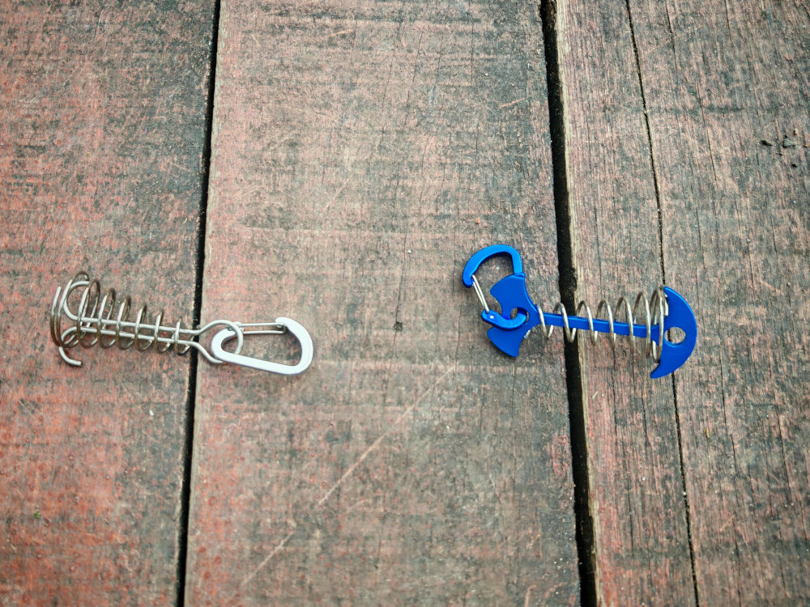

# Gazebos And Power Sockets

There are gazebos with power sockets. These are shared facility, no charge for using them. Some of the gazebos have tables & benches, some have BBQ pit. No open fire allowed but there is a shared fire pit. You can still enjoy campfire if you bring firewood.

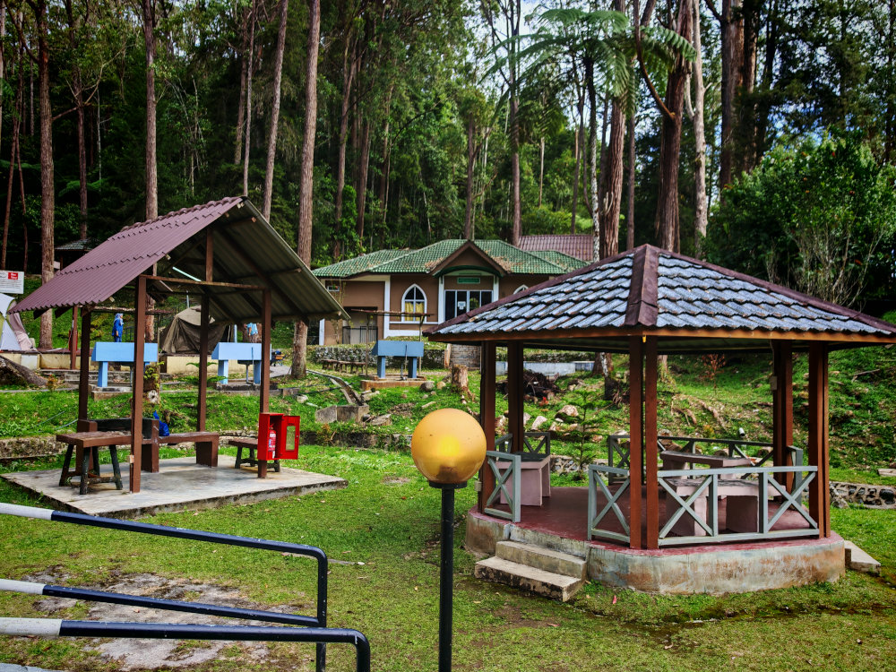

# Hobbit House

There is a "Hobbit House" up the hill, with 3 hobbit houses. Nothing fanciful, just a place for photo taking.

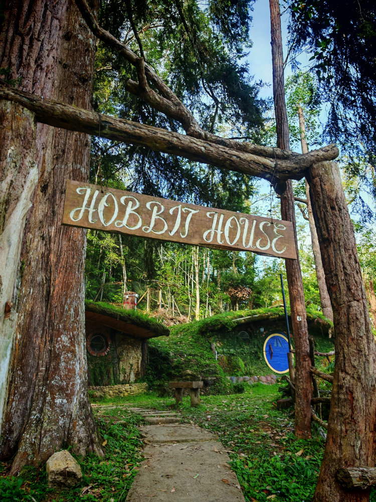

# Basins and Water Supply

There are sufficient basins throughout the campsite. Treated water safe for cleaning and cooking.

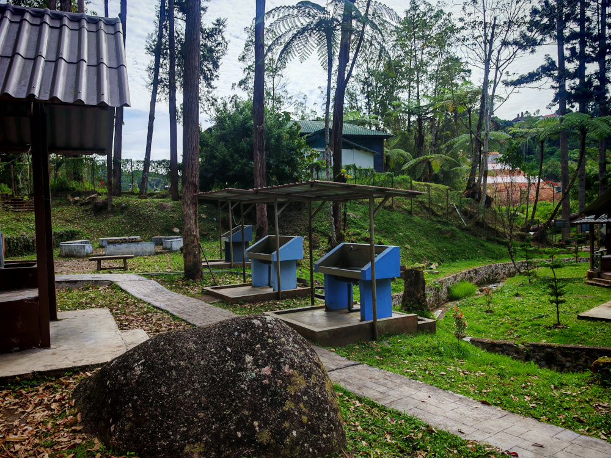

# Toilet

Toilet and shower are separated. Some of the showers comes with heater, this is much needed in cold weather. The heaters are working well in the female section. The heater that I used does not produce warm/hot water, at least the water is not icy cold 🥺.

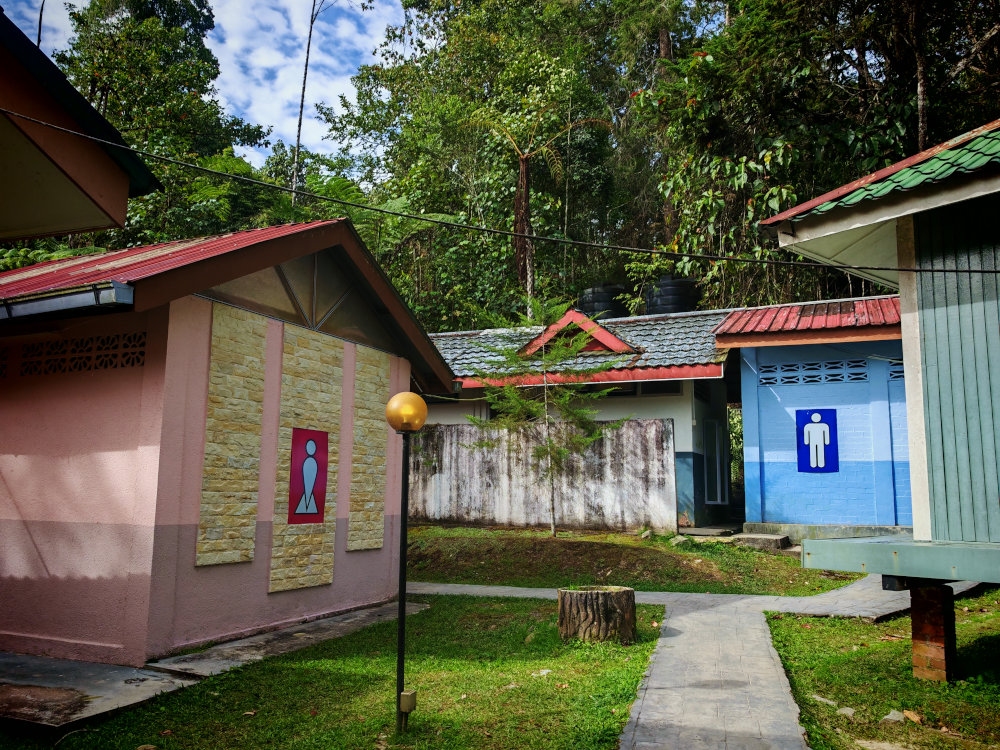

Although there are stains on wall, the toilets are cleaned daily. No bad smell.

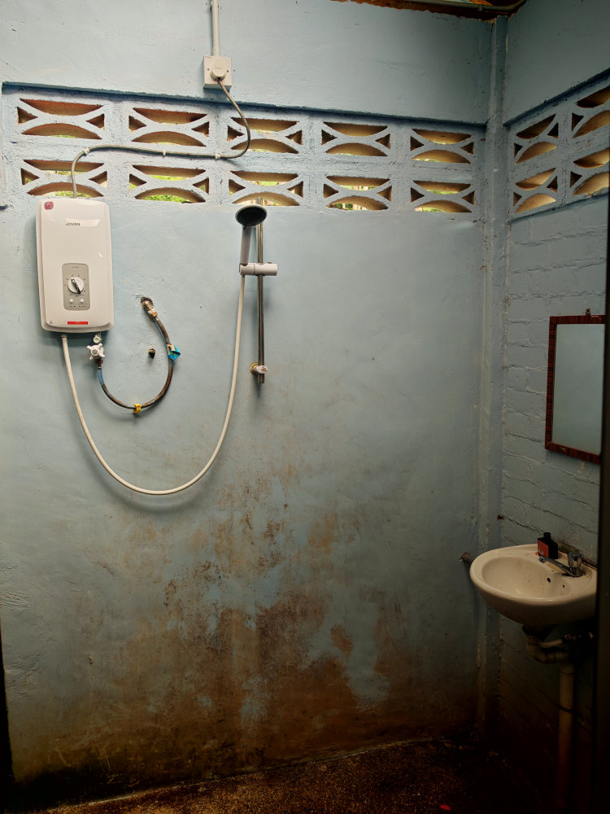

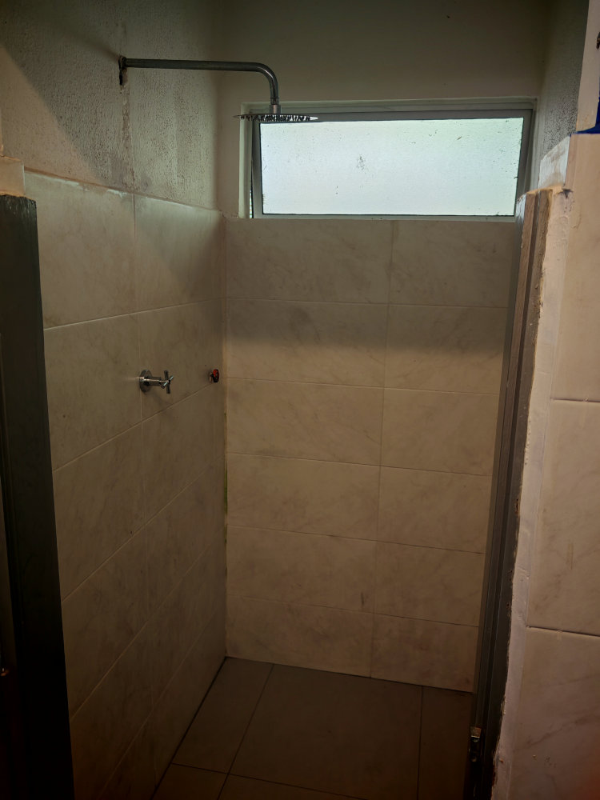

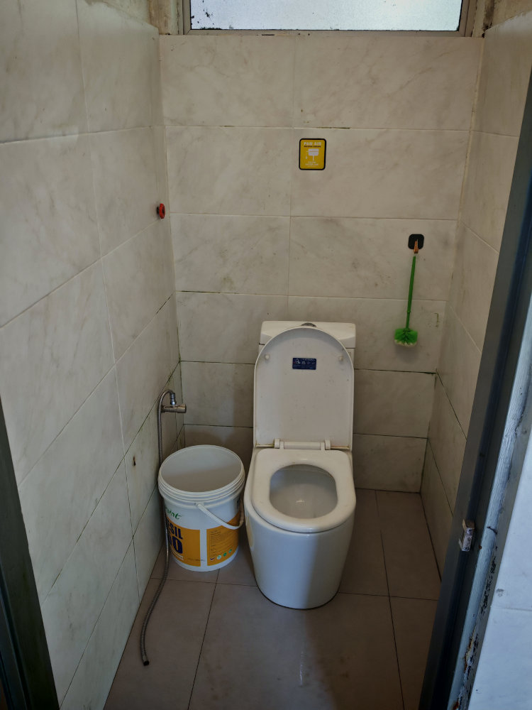

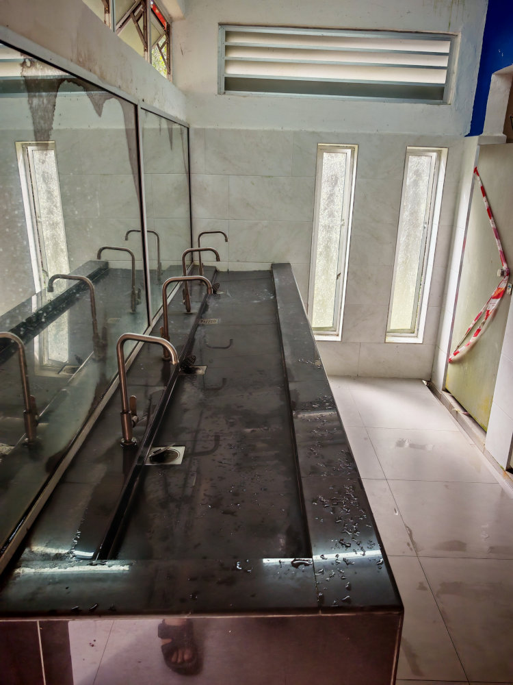

2 of the cubicles in male toilet are not usable.

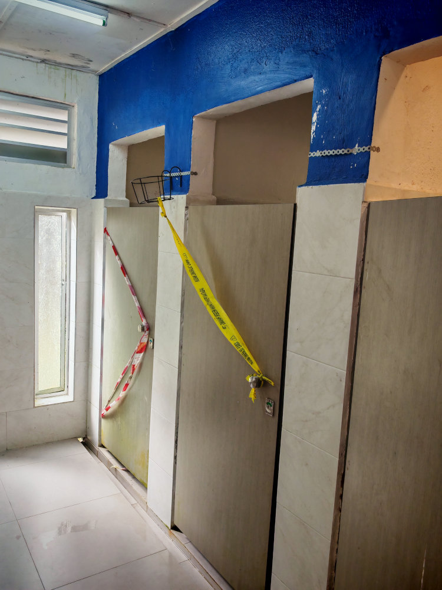

# Sound Of Flowing Water

There is a small canal that runs through the campsite. Water is cold and clean. The sound of flowing water is very smoothing.

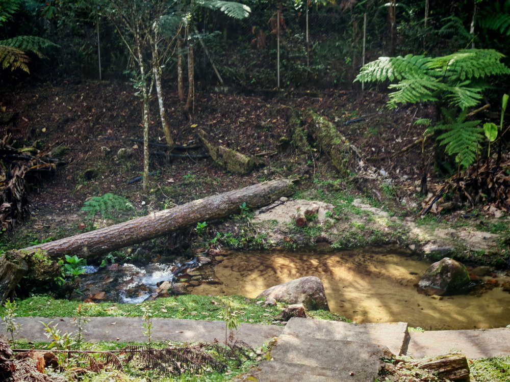

# Getting There

It is easy to get there, just search for "[Taman Eko Rimba Sungai Pauh](https://maps.app.goo.gl/NnXGNEXn1SB1BHc6A)" in Google Map. It is very near [Abang Strawberry](https://maps.app.goo.gl/1NRGKc9Wa8caqbPK7). Once you reached a guard house, ask the guard for instruction on where to park your car. There is a distance between carpark and campsite making it inconvenient for carrying camping equipments. The road in front of the campsite is very narrow. The trick is to reach there early and park beside the small road. It can accommodate up to 6 cars, first come first serve.

# General Information

Book online at https://forestry.pahang.gov.my/e-ecopark/, no walk-in allowed. It is usually fully booked during weekends, so book early.

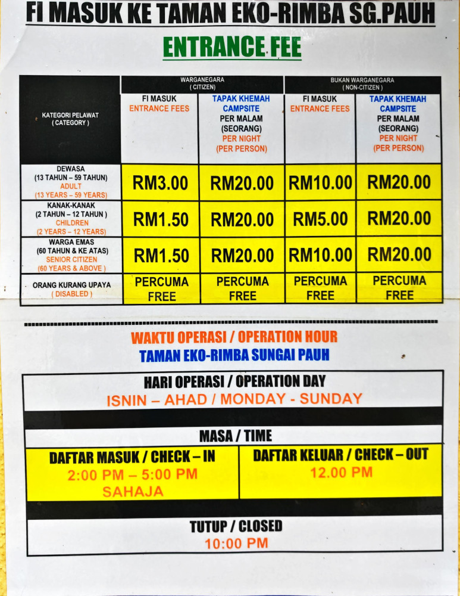