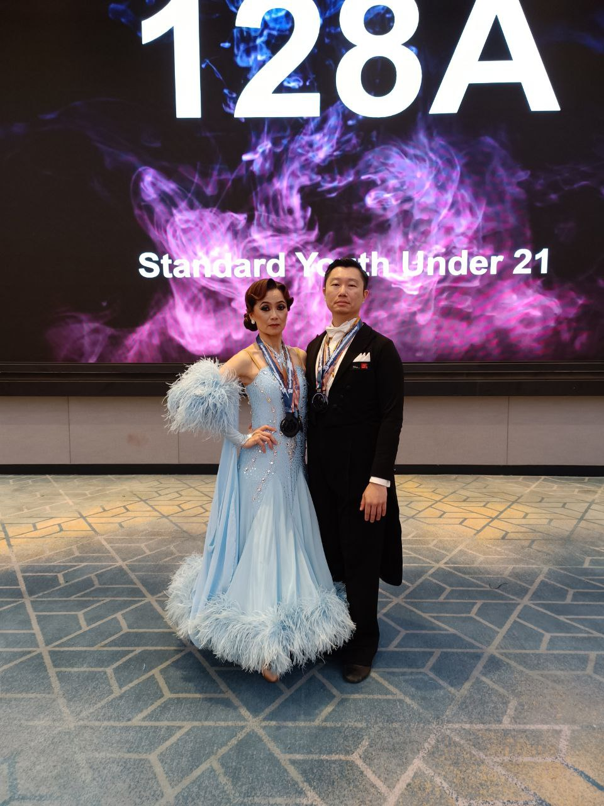
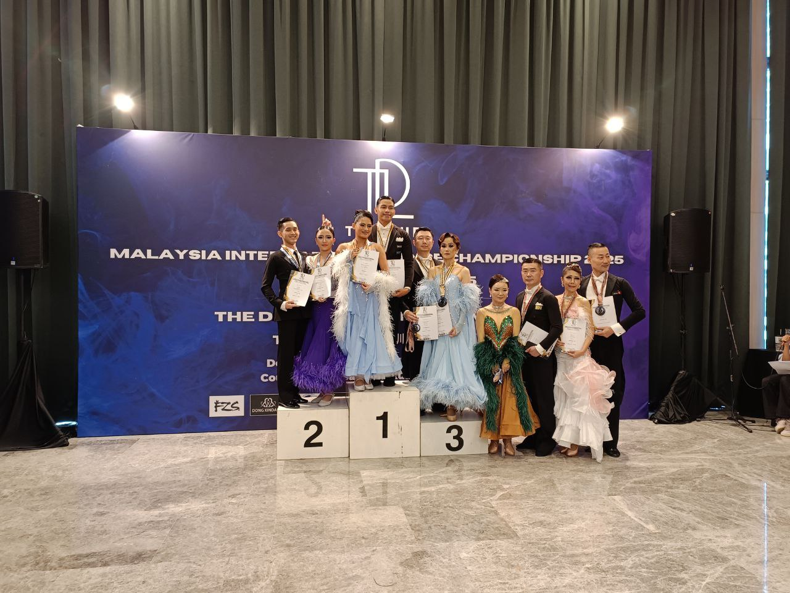

## Dance Camp and Competition In Kuala Lumpur

I was in **Kuala Lumpur** last week (December 5th – 7th) for the **TDL Cup 2025** dance event. The schedule included two days of an intensive dance camp, followed by the competition on the final day.

## Competition Results

Knowing that Quickstep is our primary weakness, we strategically avoided events featuring it when possible. Here are our results from the competition:

| Event Category | Dances | Result |
| :--- | :--- | :--- |
| **Pre-Amateur** | Waltz, Tango, Quickstep | **3rd place** |
| **Senior Over 35 (2 Dances)** | Waltz, Tango | **2nd place** |
| **Senior Over 35 (3 Dances)** | Waltz, Tango, Foxtrot | **4th place** |
| **Amateur Rising Star Single Dance** | Waltz | *No Competition* |
| **Amateur Rising Star Single Dance** | Tango | *No Competition* |
| **Amateur Rising Star Single Dance** | Foxtrot | *No Competition* |

")
")

## Key Learnings from the Dance Camp

The camp featured four insightful lessons delivered by two different teachers. Two core concepts stood out:

### 1. Continuous Body Weight Movement

It is crucial that **both the standing leg and the moving leg are *constantly* in motion**, even if at different speeds. The objective is to connect more deeply with the music, contrasting with a common "wait-and-step on each beat" rhythm, which is a bad habit to avoid.

### 2. Using Body Alignment for Balance

We can improve footwork and correct weight placement by using our body parts as positional references. The ideal alignment is:
* **Rib cage** positioned directly above the **toe**.
* **Tailbone** positioned directly above the **heel**.
This mental reference proved very helpful in finding and maintaining balance.

## Post-Competition Reflection

* **Initial Performance Jitters:** My performance in the first few rounds was quite shaky. Although I kept my body warm with plenty of practice right before the event, it took some time for my mind to calm down. I was thankfully able to gradually achieve my normal standard in the subsequent rounds.
* **The Importance of Calm:** Gaining control and calming the mind during a competition is essential. This is what allows me to enter the optimal condition, or "state of flow."
* **Training Focus:** My avoidance of Quickstep in practice showed. I need to dedicate significantly more time and effort to mastering the Quickstep moving forward.