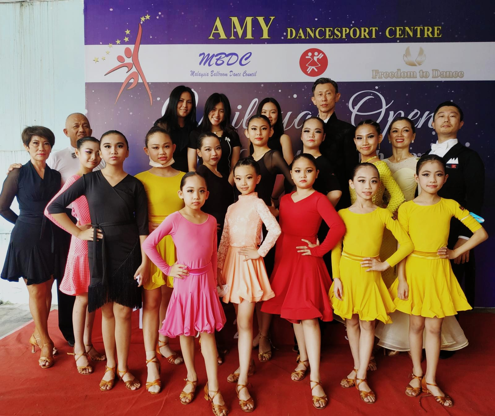
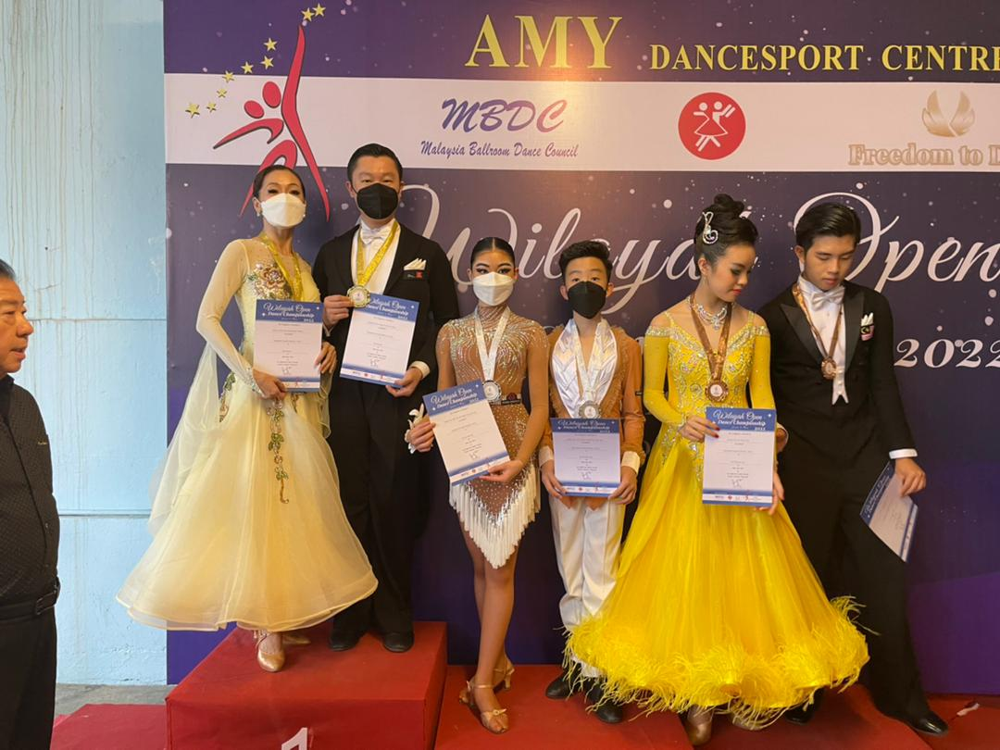

Attended Wilayah Open Dance Championship 2020, organised by Amy Lee ([Amy Dancesport Centre](https://www.facebook.com/amydancesportcentre1)) on 10 July 2022. This is the first time I attend a physical competition since COVID lockdown in Malaysia.

<!--more-->

This is also my first physical competition with Ai Choo. Initially Ai Choo was reluctant to compete, eventually teacher managed to convince her. We started preparing in June and worked very hard for it.

Including us, there are 3 couples. The competitors are in their youth, they have the advantage of agility and stamina. I was quite surprised that we won first place for Waltz & Quickstep. Due to fast timing of Quickstep, it is easy to lost control. I think we are relatively more stable than competitors.

We got third placing for Waltz & Tango. It shows that I really need to work on Tango. I want to improve the staccato movements and also turnings (Basic Reverse Turn, Reverse Turn, Fallaway Reverse and Slip Pivot).

For Waltz I want to improve my lowering, sways and swings.

I was quite calmed right until I was standing in the holding area, waiting to enter the dance floor. I started to feel nervous. Fortunately Ai Choo calmed me down and helped me to stay focused.

# Need For Competition

In group class, I was relatively better than classmates as I started picking up ballroom dancing earlier. Although I knew there are many other dancers that are much better than me, but the motivation is not strong enough.

Competition gives me the extra push I needed. Once I signed up for competition, there is a mixture of stressed, urgency, and anxiety. This pushes me to work really hard to improve myself in the shortest time possible. Competition is a reminder that there are so much I need to work on. Therefore competing regularly is good for growth.

# Lesson Learned

* Rehearsal in the morning
	* It is very important to test out the dance floor. By testing, I mean dancing with effort, and cover as much area as possible. This is to get used to the slipperiness/roughness of floor. Also to identify rough/uneven areas.
	* Arrive before the scheduled rehearsal time, be the first one to enter the dance floor. During rehearsal, the floor will gradually be crowded with people. Especially for Standard dances, it is easier to dance when there is lesser people on the floor.
	* Once the floor is crowded, continue to dance. Make adjustments (e.g. smaller steps, changing directions) and try to move around people.
* Be early. Unexpected things might happen. E.g. lack of parking lots, delay during registration process, unable to find venue.
*  First dance of the day is always the worst. So find a place and warm up with with your partner. It can be corridor, or a corner of the room, or outside dance hall. Practice different figures to get your body in condition.
* Competition can be stressful, human tends to get negative emotions in such condition. Take note of your emotion, and find ways to calm down. When you are aware of your anger/grumpiness, remember that competition stress is not your fault, neither is your partner/teacher/anybody's fault. Focus on your dance, you have no time to be distracted by negative emotions.
* I spent too much time on Waltz, and neglected other dances. I need to spend more time to Quickstep, Tango, and Foxtrot.

# Appreciation

* Sammy is an awesome teacher. He is experienced in training dancers and cares about us. For competition, he sacrifices his personal time to give us extra lessons. I am grateful for that.
* Ai Choo dislikes competitions. Once she agrees to compete, she puts in her 100%. I really respect her for that.
* Ai Choo is a very hardworking dancer, way more hardworking than me. It motivates me to work harder. As a leader role in a dance partnership, I need to be better to be able to effectively lead her in dancing. 
* Ai Choo and I have disagreements from time to time, but we both really like dancing. So both of us are willing to find common ground and make this partnership works.