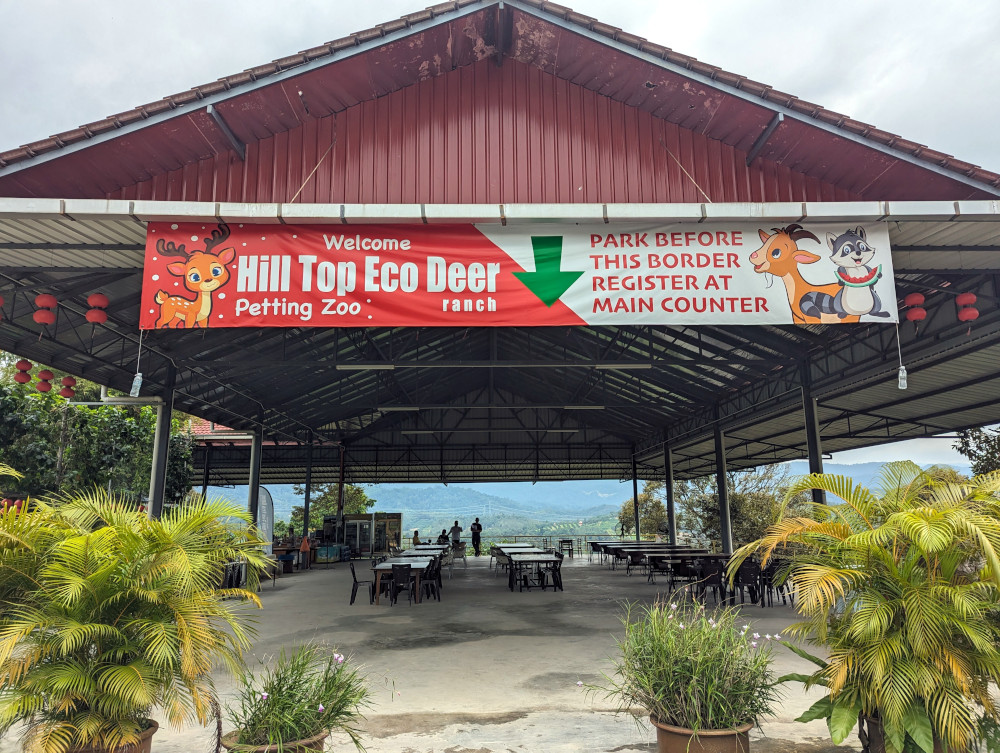
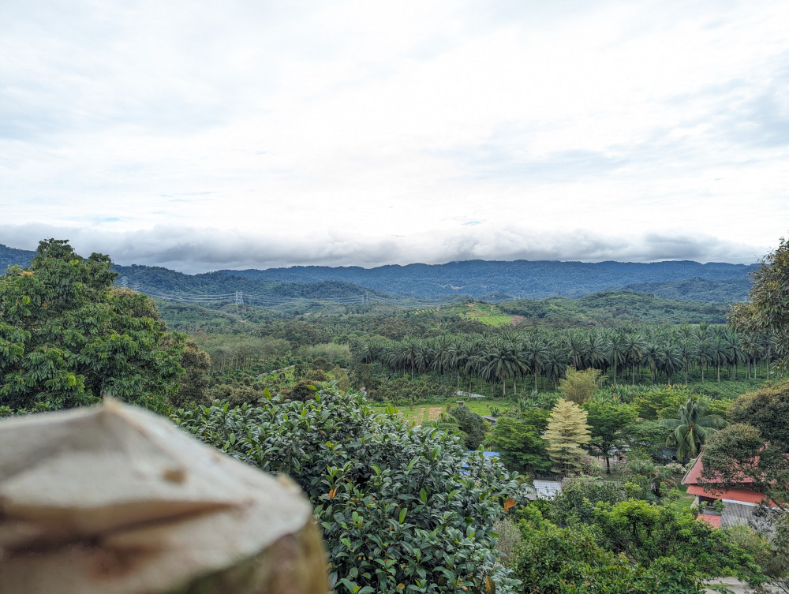
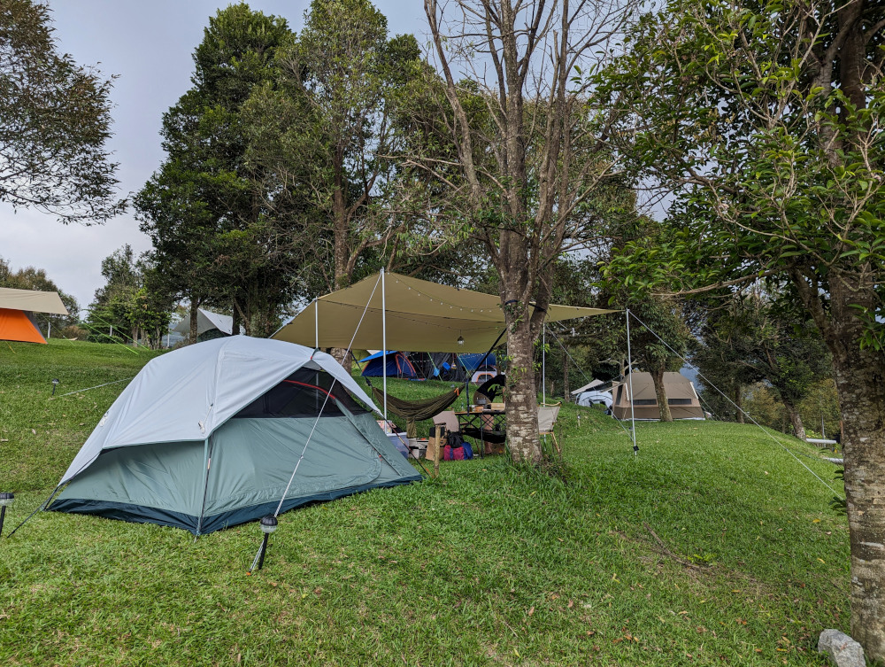
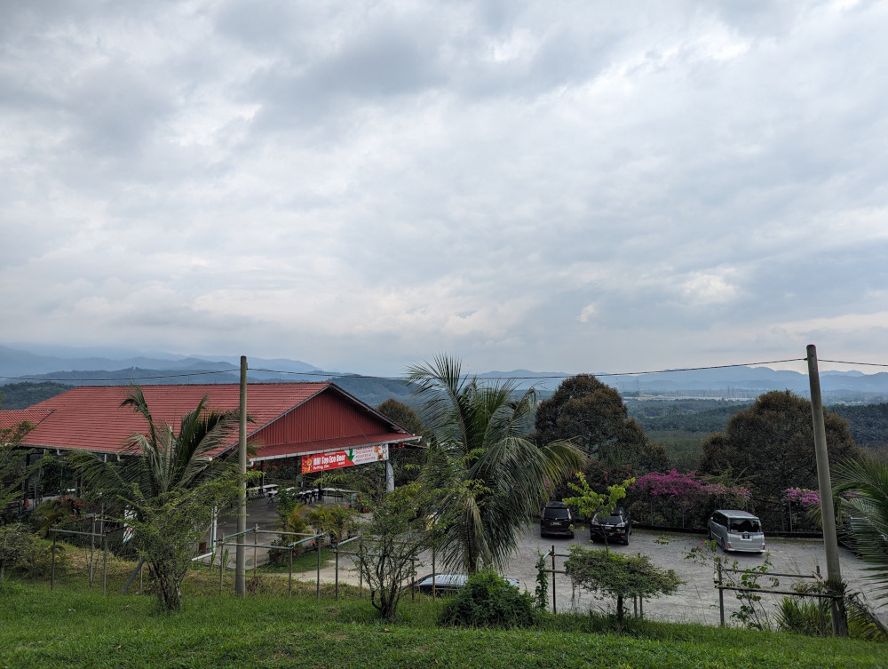

This is my 6th camping trip, first one outside of Johor. I decided to celebrate Christmas at Yaka Campsite. I love this campsite and will definitely visit it again, but not during rainy season.

<!--more-->

# Impression

Yaka Campsite is located on a hill in Lenggeng, Negeri Sembilan. When I reached the campsite, I am greeted with this large common area. I park my car in front, and did my registration and payment in the common area.

The common area has plenty of tables and chairs. It offers cooling coconuts, drinks, and snack (_but no cooked meal_). Before I leave, I spent some time there sipping coconut juice while enjoying the scenic view. 

# Booking And Getting There

Booking can be done through Whatsapp [+60 19‑242 9659](https://web.whatsapp.com/send/?phone=60192429659). There are choices of Hilltop, Terrace (hill slope), and Car Camp zone. The allocated slot will be confirmed when you visit the common area. Address: [Jalan Broga, 71750 Lenggeng, Negeri Sembilan](https://maps.app.goo.gl/EELLeB2QjiKdxbmM9).

# Carpark

Car Camp zone comes with attached parking spot. For Hilltop and Terrace zones, you have to park your car on the hilltop with everyone else. There is a distance between carpark and campsite. I have to make multiple trips between my car and the campsite to load and unload camping equipments. Camping wagon is not usable on hill slope. I have seen people carrying the camping wagon by hand, it looks tiring and heavy to me.

💡 **TIP** Book Hilltop zone whenever possible. It will save you from carrying heavy equipments up and down hill slopes.

# Rainy Night

It has been raining daily in December 2023, and it rained throughout the night when I was there. The campsite is a terraced slope. The campsite operator dug shallow trenches along the bottom of the slopes to direct rain water that flows down the slope. There are also pipes beneath the ground to direct excessive rain water. This is good for light rain, but not effective against long hours (overnight) of heavy rain.

Fortunately there is no flooding, but there are shallow mud puddles. After a nice shower, my feet get dirty immediately when I walk back to my tent. Lesson learned, avoid camping during raining season. 

One advantage of camping on a hill is having an elevated view. It feels very calming to enjoy the view while having a nice cup of coffee.

# Toilet

The toilets are clean and well maintained. External basins and clean water.

# General Information

Checkout the website, https://www.yakacampsite.com/, for pricing and information on facilities. It also has an official Facebook page at https://www.facebook.com/yakacampsite/.
