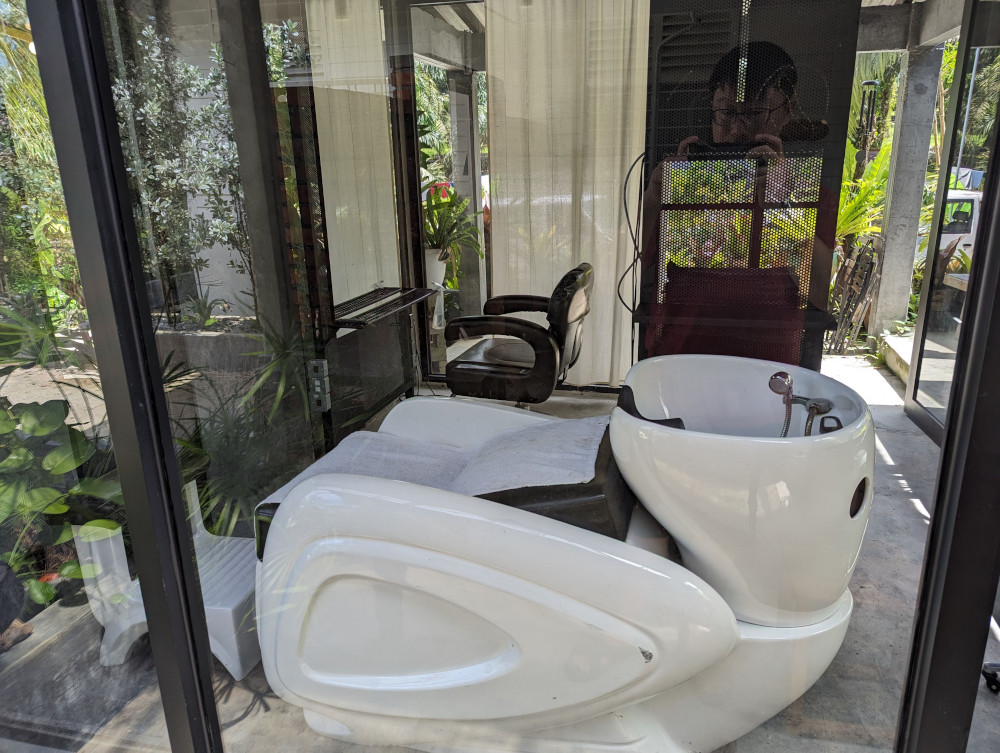
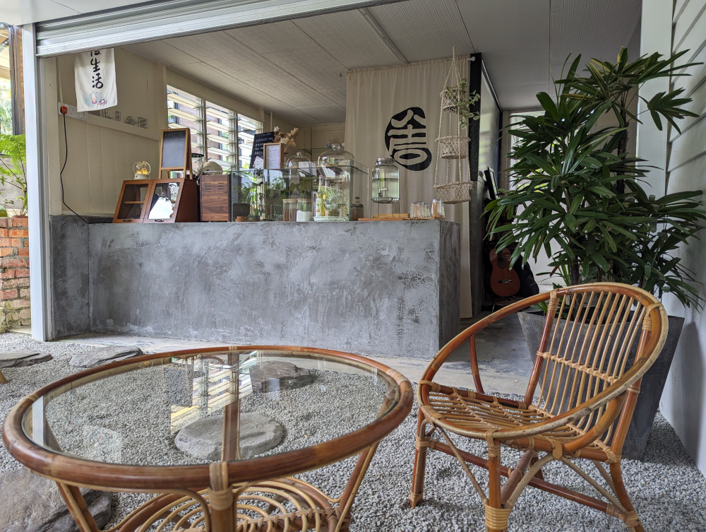
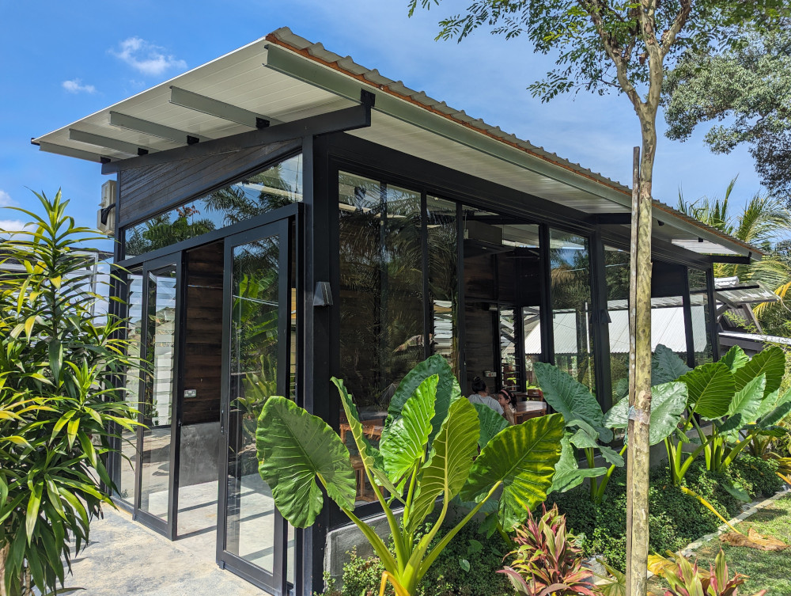
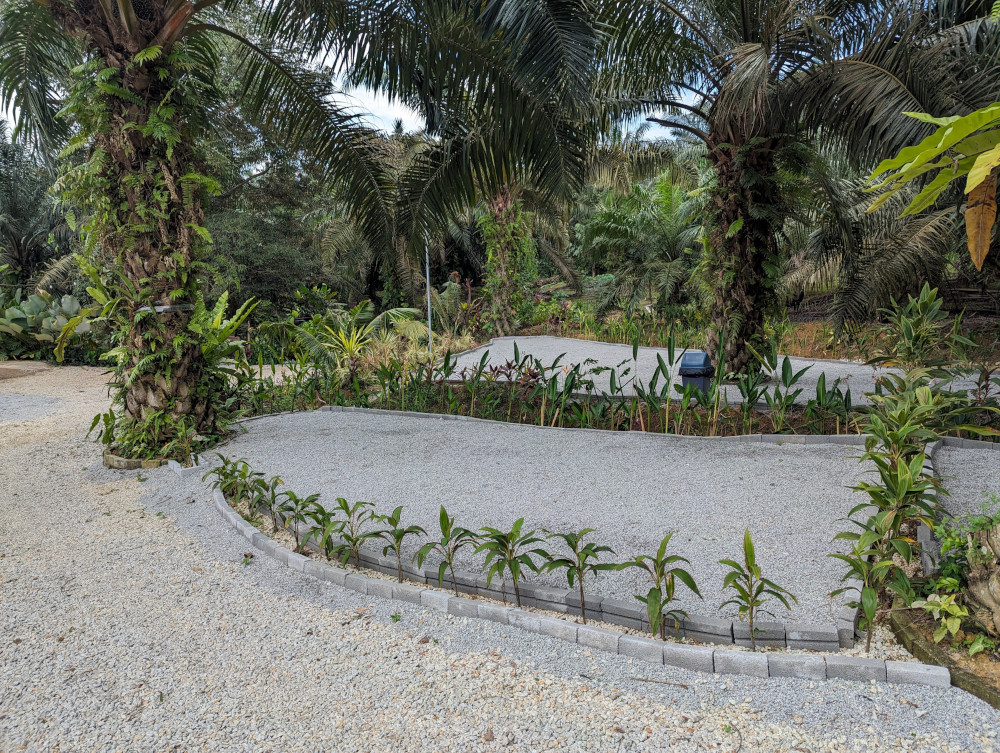
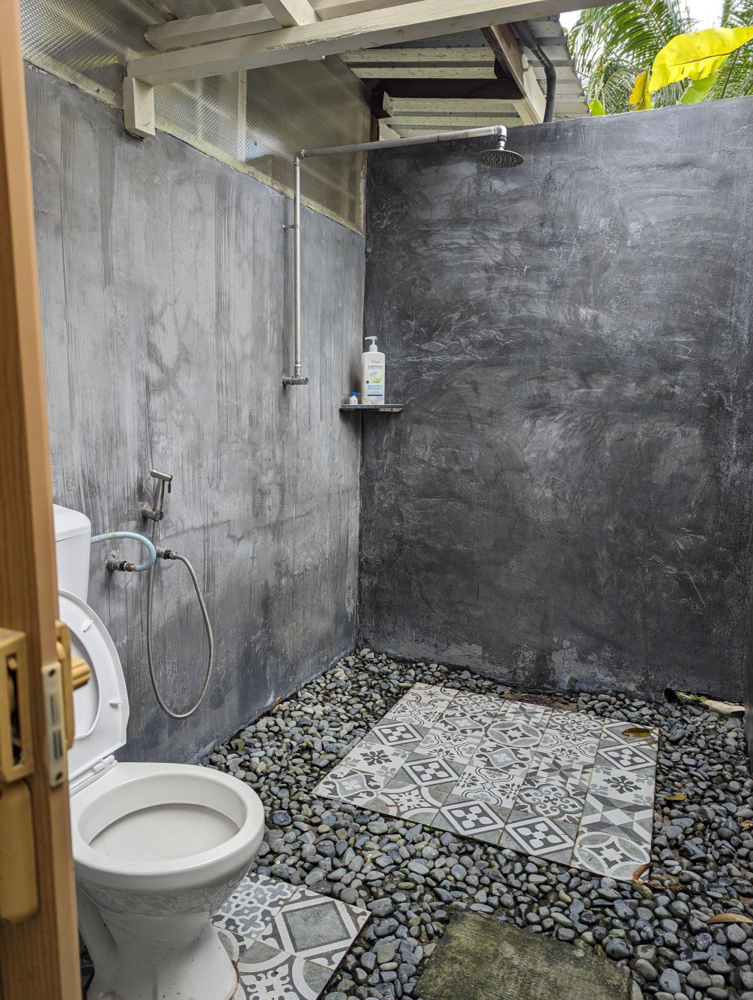
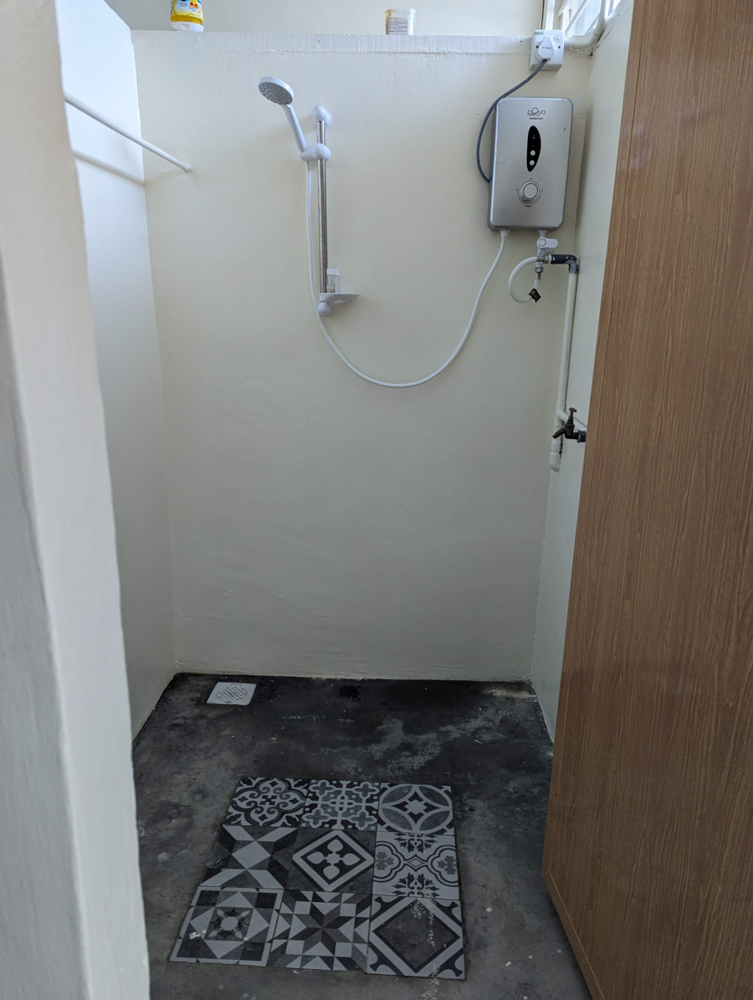

This is my 4th camping trip. It is a new campsite that is not publicly announced yet. This campsite is currently under trial run and undergoing improvements. I get to know this secretive place from a [Facebook post](https://www.facebook.com/groups/317188350398491/posts/653090686808254/).

<!--more-->

# Impression

This is campsite is operated by a married couple with stories to share. Husband is a hair stylist, he runs the mini saloon. Wife is a barista, she manages the cafe and campsite. She is a very warm person, and they did all of this out of passion, it is their way of loving life ❤️. They live here, they build this place up from scratch. Everything here is a result of their passion.

The cafe does not serve food, only drinks. I ordered a specialty coffee (特调咖啡), which is latte with crush peanut. It is rich and filled with texture, I will recommend it to coffee lovers. The cafe is not enclosed and blends in with the nature. The operator took effort to grow plants around the cafe and throughout the campsite. For non-campers, appointment must be made before visiting the cafe.

There is a glasshouse opened to campers. It is suitable for gathering and shelter from bad weather. There are tables, chairs, power outlets, and air conditioner.

Filtered water dispenser is available.

# Campground

The campground is paved with small rocks. Sleeping directly on the ground will be uncomfortable. Definitely need a floor mat or sleeping pad (I have a air mattress). There are 3 slots, 2 small and 1 large size. Each slot is surrounded with plants, giving it some sense of privacy. Maybe I arrived after a raining morning. The soil is too soft, not easy to setup large tarp. Do bring long tent pegs.

This place is really clean, decorated and well maintained.

# Booking And Getting There

The campsite is 10-minute drive from Pagoh toll. Exact location will be informed upon successful booking. Contact the operator via Whatsapp [+60 12-613-5294](https://wa.link/fjopli)

# Toilet

There is an outdoor bathroom which opens 24 hours a day. There are also 4 indoor bathrooms, which is opened from 0000H ~ 2000H. 1 of the indoor bathroom is equipped with heater for people who like warm water bath. The other indoor bathrooms adopt roofless concept. Hairdryer is provided too! The bathrooms are renovated and very clean. This is a huge different from the usual _kampung_ style bathroom.

There are also basin both indoor and outdoor. Water is clean.

# General Information

* Fee per slot: RM 60/tent/day
* Fee per person: RM 10/adult, RM 5/child
* Thrash fee: RM 10/tent
